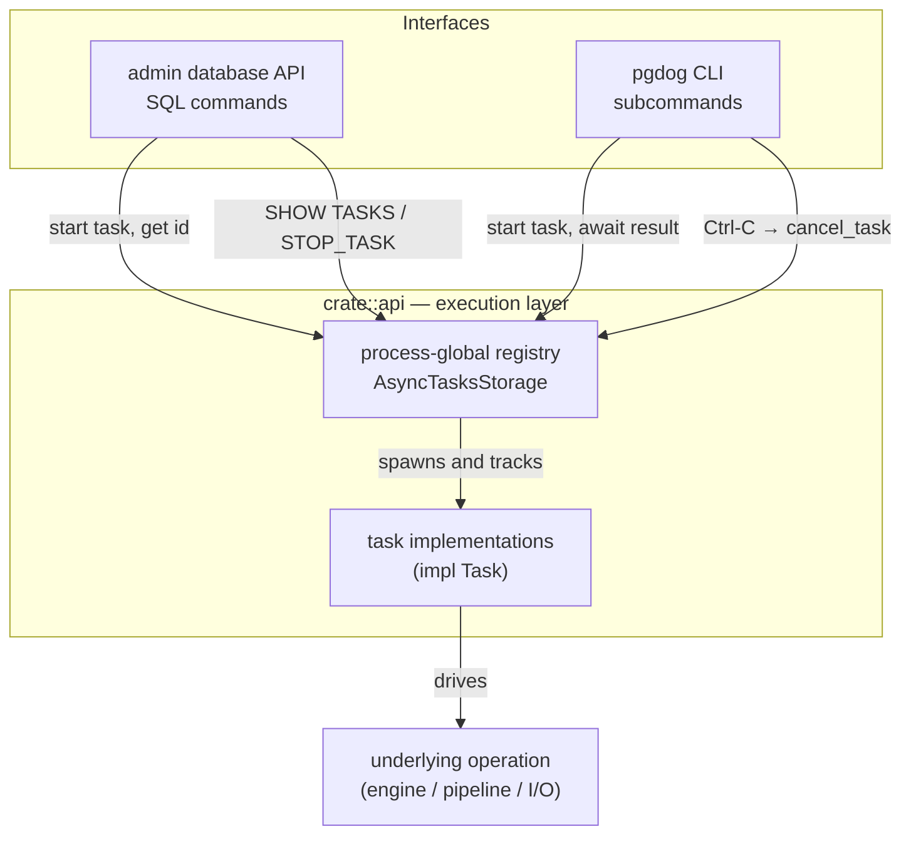

# Async Task Framework — Architecture

The `crate::api` module ([`pgdog/src/api/`](../pgdog/src/api/)) is the execution layer that sits
between PgDog's two user interfaces and its long-running operations. Any operation that may run for
seconds to hours runs here as a background *task*.

The central principle is that **the task is the single source of truth for execution**. A user
interface only assembles options and starts the task; all behaviour, status transitions, and error
handling live inside it. Whether an operation is started through a SQL command on the admin
database or a terminal invocation of the CLI, the same task runs the same code.

This document covers the framework itself — how tasks are started, tracked, composed, cancelled,
and observed. It deliberately does not enumerate the individual task implementations; each task's
behaviour is documented alongside its own code in [`pgdog/src/api/`](../pgdog/src/api/).

---

## Architecture



A task is any type that implements the `Task` trait
([`api/async_task.rs`](../pgdog/src/api/async_task.rs)): it defines its own status type, output, and
error, and provides an `async run`. The framework owns everything around that `run` — spawning,
registration, id assignment, status storage, cancellation, and retention.

---

## The registry

When a task is started via `crate::api::start()` ([`api/mod.rs`](../pgdog/src/api/mod.rs)), it is
spawned as an async future and immediately registered in `AsyncTasksStorage`
([`api/async_task.rs`](../pgdog/src/api/async_task.rs)) under a monotonically-increasing integer id.
The id is returned before any work begins, so the caller can track the operation while it runs in
the background.

One registry serves the entire process. A task started by the CLI and a task started through the
admin SQL API are both registered in the same store and are equally visible to `SHOW TASKS` and
equally cancellable by `STOP_TASK`. A task spawned automatically by another task registers itself
the same way and is just as addressable from either interface.

**Terminal tasks are retained for 24 hours** after they finish so their outcome can be inspected.
A running task is never pruned. `SHOW TASKS` filters terminal tasks back out and shows only what
is currently running; the retention period exists only so that an id returned by a command
continues to be addressable for a reasonable window after completion.

---

## Task composition

A task can spawn *child tasks* through its execution context. Children share the root task's
registration entry and appear as a flat subtask list on the root's snapshot in the registry. The
root's status describes which high-level phase is active; the child's status describes what is
happening within that phase. A composite task that sequences several phases therefore reports
fine-grained progress without any special support from the registry — each phase is just a child
task whose status bubbles up.

`SHOW TASKS` surfaces both the root and its running children as separate rows, so a child appears
with its own type even though it was never started as a top-level command. `STOP_TASK` only
addresses root tasks by id; cancelling the root propagates to all its children through the
cancellation token hierarchy (see [Cancellation](#cancellation) below).

---

## Status lifecycle

Every task type defines its own set of progress stages. The registry stores a type-erased
snapshot of the current status on every write and exposes it through `SHOW TASKS`. A task begins
in `Started` the moment it is registered, transitions through `Pending(stage)` as it reports
progress, and ends in one of four terminal states:

- **`Finished`** — completed successfully.
- **`Cancelled`** — stopped by `STOP_TASK`, Ctrl-C, or parent cancellation.
- **`Error`** — the task's code returned an error; the message is stored in the status.
- **`Panic`** — the task's future panicked; the message is stored.

Terminal states are **write-once**: a context clone that outlives the task cannot overwrite a
recorded outcome.

---

## Cancellation

Every task holds a `CancellationToken`; a child's token is `parent.child_token()`, so cancelling a
task cancels its whole subtree.

Cooperative vs. not is decided by one call. `ctx.cancellation_token()` sets `cooperative = true` as
a side effect and hands back the token:

```rust
pub fn cancellation_token(&self) -> CancellationToken {
    self.task.cooperative.store(true, Ordering::Relaxed);
    self.task.cancellation_token.clone()
}
```

The watcher branches on that flag when the token fires:

```rust
ctx.transition(TaskStatus::Cancelling);
if cooperative {
    // grace period, then force-abort
    match timeout(T::cancel_timeout(), &mut handle).await {
        Ok(res) => res,
        Err(_) => { handle.abort(); handle.await }
    }
} else {
    handle.abort(); handle.await   // never took the token → abort now
}
```

A cooperative task typically `select!`s its work against the token and runs its own shutdown
before `run` returns, within `cancel_timeout()` (default 5s). A non-cooperative task never takes
the token and is aborted immediately — fine when dropping the future already tears the work down
(e.g. in-flight units in a `JoinSet`).

`STOP_TASK` calls `cancel_task(id)`, which returns `None` for an unknown or already-terminal id
(so callers don't claim success or emit cleanup warnings for a finished task) and otherwise calls
`entry.cancel()`.

## Composition

`ctx.run(child)` spawns a subtask:

```rust
pub fn run<T1: Task>(&self, task: T1) -> AsyncTaskWaiter<T1::Output, T1::Error> {
    run_task(Some(&self.task), &self.task.subtasks, task)
}
```

All descendants register in the *root's* `subtasks` map, so `TaskSnapshot.subtasks` is a flat list
of every descendant ordered by id (their own `subtasks` are always empty). `SHOW TASKS` renders
the root and its running children as separate rows. `STOP_TASK` only addresses roots; the token
hierarchy propagates the cancel downward.

## Retention

`AsyncTasksStorage` prunes on every `run`/`tasks`/`task` call. `prune()` drops entries whose
terminal state is older than `retention` (`TASK_RETENTION = 24h`); running tasks are never dropped.
So an id stays addressable, with its final status and last `inner_status`, for 24h after it
finishes.

## The two callers

Both go through `AsyncTaskWaiter`; the difference is what they do with it.

- **Admin** ([`pgdog/src/admin/`](../pgdog/src/admin/)): fire-and-forget. Take `.id()`, drop the
  waiter, return the id to the client. The client polls `SHOW TASKS` and runs `STOP_TASK <id>`.
- **CLI** ([`cli.rs`](../pgdog/src/cli.rs)): await the waiter in a loop. On Ctrl-C, call into the
  registry to cancel, then keep awaiting until the task winds down before exiting.

Same task, same options, same status transitions, same error path either way.
