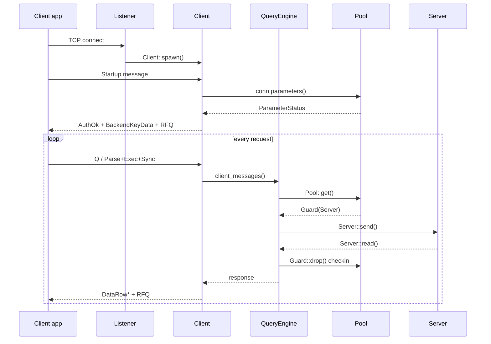
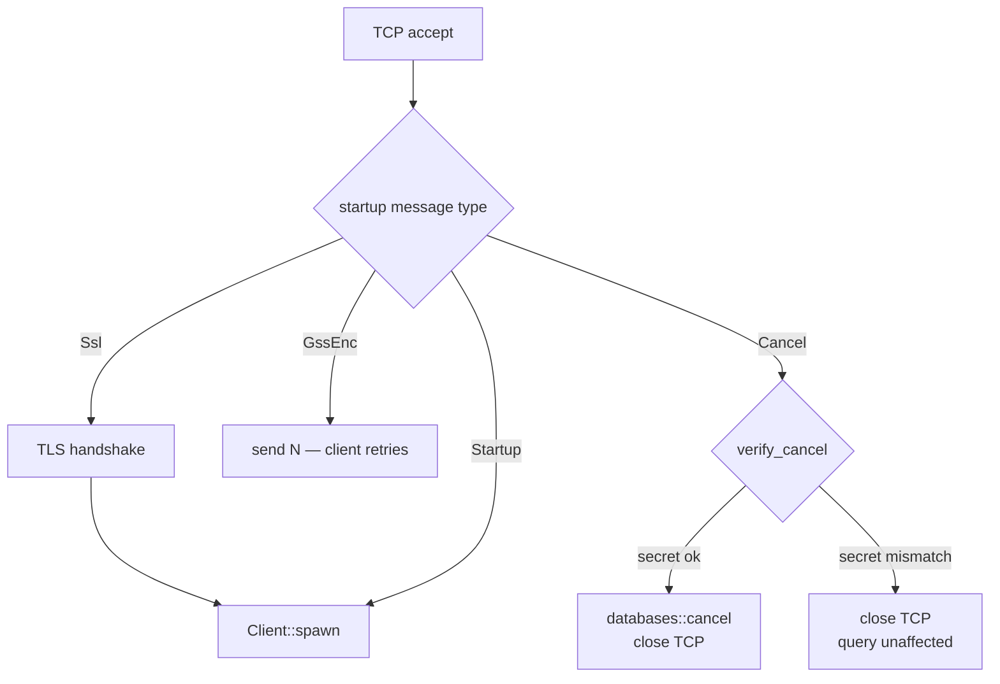
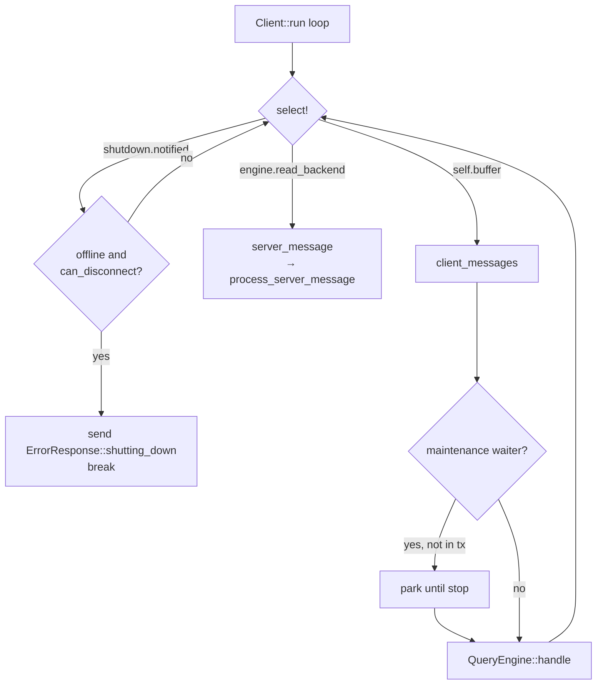
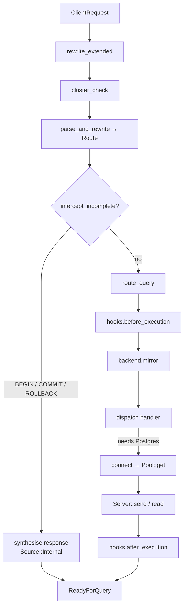
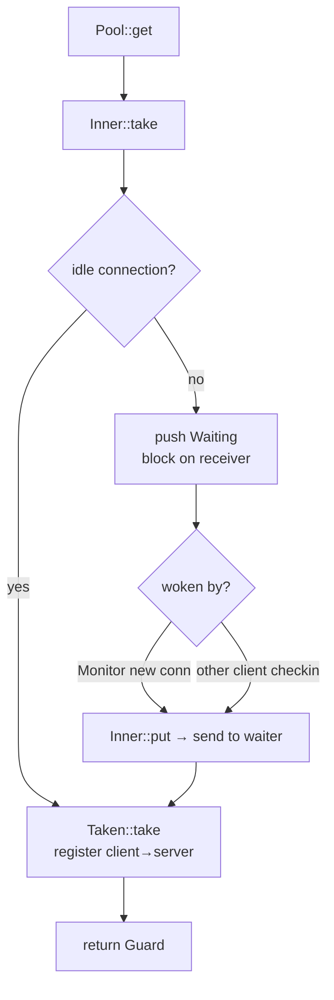
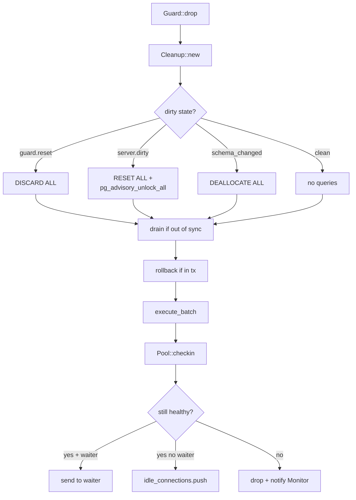
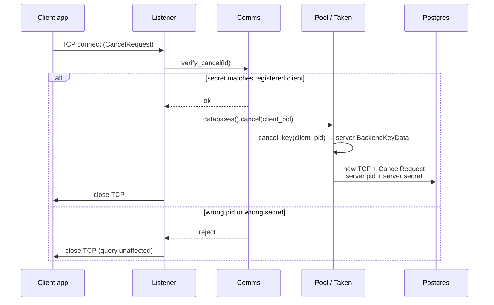

# Client connection lifecycle

Traces a PostgreSQL client message from TCP accept to response delivery.

pgdog is a connection pooler and query router. Clients connect to it as if it were Postgres; it speaks the wire protocol on both sides and maintains a pool of real server connections behind it.

---

## Key concepts

Six types recur throughout the codebase. Understand these before following the flow.

**`BackendPid` — identity, not process ID.** Every client and every server connection gets a `BackendPid` (see [`net/messages/backend_pid.rs`](../pgdog/src/net/messages/backend_pid.rs)). For clients, pgdog mints a sequential synthetic pid; for server connections it reads the pid from the Postgres handshake. Cancel routing, server tracking, and message tagging all use `BackendPid`.

**`Source` — message origin.** Every `Message` (in [`net/messages/mod.rs`](../pgdog/src/net/messages/mod.rs)) carries a `Source` tag: `Backend(BackendPid)` for messages from a Postgres socket, `Frontend` for messages from the client, and `Internal` (the default) for messages synthesised by pgdog. The `Debug` formatter uses this to disambiguate byte codes shared between directions — the same byte `D` is `Describe` from a client and `DataRow` from a server.

**`Guard` — RAII pool checkout.** `Guard` in [`backend/pool/guard.rs`](../pgdog/src/backend/pool/guard.rs) wraps a `Box<Server>` with `Deref`/`DerefMut`; `Drop` triggers cleanup and check-in. The connection always returns to the pool (or is closed) when `Guard` falls out of scope.

**`Route` — routing decision.** The query engine produces a `Route` (in [`frontend/router/parser/route.rs`](../pgdog/src/frontend/router/parser/route.rs)) for each query: shard(s), role (primary or replica), and aggregation metadata for multi-shard merging. The rest of the system acts only on `Route` and never re-inspects the SQL.

**`ClientRequest` — extended-protocol buffer.** The extended protocol is a multi-message sequence (Parse → Bind → Describe → Execute → Sync). pgdog buffers messages into a `ClientRequest` (in [`frontend/client_request.rs`](../pgdog/src/frontend/client_request.rs)) and dispatches only when the sequence is complete (Sync or Flush). Simple Query (`Q`) is dispatched immediately.

**`Sticky` — per-client routing pins.** `Sticky` in [`frontend/client/sticky.rs`](../pgdog/src/frontend/client/sticky.rs) has two fields set at login: `omni_index` (a random value that pins all of one client's omni-shard queries to the same shard — per client, not per statement) and `role` (from the `pgdog.role` startup parameter). Both are set once and never change.

---

## High-level flow



---

## 1. Connection acceptance

Entry point: `Listener::listen()` in [`frontend/listener.rs`](../pgdog/src/frontend/listener.rs).

Each accepted TCP socket becomes a Tokio task in `handle_client()`. Before constructing a `Client`, the listener resolves the startup type:



- **SSL** (`Startup::Ssl`): wraps the socket in TLS; records the peer certificate for mTLS auth.
- **GSS** (`Startup::GssEnc`): rejected — pgdog sends `N` and the client retries.
- **Cancel** (`Startup::Cancel`): the listener calls `comms().verify_cancel(&id)` before anything else. On mismatch the TCP connection is closed and the running query is unaffected — no error is sent to the caller. On success, `databases().cancel(id.pid)` is called and then the TCP connection is closed. Handled here, before any `Client` exists — this is why the cancel path is entirely separate from the query path.
- **Startup** (`Startup::Startup`): negotiation complete; falls through to `Client::spawn()`.

The socket is wrapped in `Stream` (in [`net/stream.rs`](../pgdog/src/net/stream.rs)) for a uniform `send` / `read` / `flush` interface over both plain TCP and TLS.

---

## 2. Login

`Client::login()` in [`frontend/client/mod.rs`](../pgdog/src/frontend/client/mod.rs). Runs once per connection; returns a `Client` or sends an error.

Steps in order:
1. Reject plaintext connections when `tls_client_required` is set.
2. Identify the target database and user from startup parameters; detect admin connections.
3. Mint `BackendKeyData` (in [`net/messages/backend_key.rs`](../pgdog/src/net/messages/backend_key.rs)) — synthetic pid + random secret — and create a `ClientComms` (in [`frontend/comms.rs`](../pgdog/src/frontend/comms.rs)).
4. Authenticate using the method configured for this user: Trust, MD5, SCRAM, Plaintext, or mTLS (via `stream.tls_identity()`). Passthrough auth forwards credentials directly to Postgres.
5. Send `AuthenticationOk`.
6. Reject the connection if the pooler is shutting down (`comms.offline()`) and this is not an admin connection.
7. Fetch server parameters from a pooled backend via `conn.parameters(&Request::unrouted(id.pid()))` and forward them as `ParameterStatus` messages.
8. Send `BackendKeyData` to the client (stored for future cancel requests).
9. Send `ReadyForQuery(Idle)`.
10. Call `comms.connect(id, addr, &params)` (in [`frontend/comms.rs`](../pgdog/src/frontend/comms.rs)) — registers the client in the process-wide map for cancel routing and shutdown.

`Sticky` (in [`frontend/client/sticky.rs`](../pgdog/src/frontend/client/sticky.rs)) is initialised here via `Sticky::from_params(&params)`.

---

## 3. Main client loop

`Client::run()` in [`frontend/client/mod.rs`](../pgdog/src/frontend/client/mod.rs).

```rust
loop {
    select! {
        _ = shutdown.notified()           => { /* check offline + can_disconnect */ }
        message = engine.read_backend()   => server_message(message)
        buffer  = self.buffer(state)      => client_messages(buffer)
    }
}
```



### Shutdown arm

`shutdown` is an `Arc<Notify>` from `comms.shutting_down()` (in [`frontend/comms.rs`](../pgdog/src/frontend/comms.rs)). When it fires, the loop checks `comms.offline() && query_engine.can_disconnect()`. If true, it sends `ErrorResponse::shutting_down()` and exits. Otherwise it keeps running until the current transaction completes.

### Backend push arm

`engine.read_backend()` reads from a checked-out server connection. Not just `NOTIFY` — any server-pushed message goes through `server_message()` → `query_engine.process_server_message()` (in [`frontend/client/query_engine/mod.rs`](../pgdog/src/frontend/client/query_engine/mod.rs)), which handles streaming flags, explain traces, `ReadyForQuery` transitions, 2PC finalisation, and stats.

### Client buffer arm

`self.buffer(client_state)` reads bytes from the client socket into a `ClientRequest` (in [`frontend/client_request.rs`](../pgdog/src/frontend/client_request.rs)). A request is complete (`ClientRequest::is_complete()`) when the last message code is one of `{H, S, Q, c, f, F}` or a `CopyData` chunk reaches 4 KB. `'X'` (Terminate) causes a graceful disconnect.

### Maintenance mode

Before dispatching, `client_messages()` checks `maintenance_mode::waiter(&database)` (in [`backend/maintenance_mode.rs`](../pgdog/src/backend/maintenance_mode.rs)). If a waiter is active and the client is not in a transaction, the client parks until `maintenance_mode::stop()` fires.

### Pipeline splicing

When a client sends multiple pipelined extended-protocol requests in one buffer, `ClientRequest::spliced()` (in [`frontend/client_request.rs`](../pgdog/src/frontend/client_request.rs)) splits them at `Execute` boundaries. Each sub-request runs through `QueryEngine::handle()` independently. A server error mid-pipeline skips forward to the next `Sync`.

---

## 4. Query engine

`QueryEngine::handle()` in [`frontend/client/query_engine/mod.rs`](../pgdog/src/frontend/client/query_engine/mod.rs).



The pre-dispatch pipeline, all in `QueryEngine::handle()`:

| Step | Method | What it does |
|---|---|---|
| 1 | `rewrite_extended()` | Rewrite Parse/Bind for sharding (e.g. inject shard key into parameter list) |
| 2 | `cluster_check()` | Verify the cluster is online and not in maintenance |
| 3 | `parse_and_rewrite()` | Parse SQL, extract shard key, build `Route`, rewrite query if needed |
| 4 | `intercept_incomplete()` | Synthesise responses for `BEGIN`/`COMMIT`/`ROLLBACK` without contacting Postgres |
| 5 | `route_query()` | Finalise shard selection and primary/replica choice |
| 6 | `hooks.before_execution()` | `QueryEngineHooks` extension point |
| 7 | `backend.mirror()` | Queue shadow traffic to mirror pools |
| 8 | dispatch | Call the appropriate command handler |

### Lazy backend connection

`connect()` in [`frontend/client/query_engine/connect.rs`](../pgdog/src/frontend/client/query_engine/connect.rs) is called from within command handlers (`execute()`, `connect_transaction()`), not from the top of `handle()`. Queries handled entirely by the engine — `BEGIN`, `COMMIT`, `ROLLBACK`, `DISCARD`, SET statements — never touch the pool.

`connect()` returns `bool`: `false` = recoverable (no server available, engine synthesises an error); `true` = connected; `Err` = fatal.

### Synthesised responses

Messages produced by pgdog carry `Source::Internal` (in [`net/messages/mod.rs`](../pgdog/src/net/messages/mod.rs)). This distinguishes synthesised messages from real Postgres responses throughout the codebase.

### Hooks

`QueryEngineHooks` in [`frontend/client/query_engine/hooks/mod.rs`](../pgdog/src/frontend/client/query_engine/hooks/mod.rs) has five callbacks: `before_execution`, `after_connected`, `after_execution`, `on_server_message`, and `on_engine_error`. The current built-in use: schema-change detection in [`frontend/client/query_engine/hooks/schema.rs`](../pgdog/src/frontend/client/query_engine/hooks/schema.rs), which marks `schema_changed` on the server so the cleanup step issues `DEALLOCATE ALL`.

### Two-phase commit

`TwoPc` in [`frontend/client/query_engine/two_pc/mod.rs`](../pgdog/src/frontend/client/query_engine/two_pc/mod.rs) coordinates distributed transactions across shards. When a write transaction ends with `two_pc_enabled && !rollback`, `phase_one()` issues fsync-safe `PREPARE TRANSACTION` on all shards, then `phase_two()` issues fsync-safe `COMMIT PREPARED`. The WAL in [`frontend/client/query_engine/two_pc/wal/`](../pgdog/src/frontend/client/query_engine/two_pc/wal/) records `Begin` before the prepare and `Committing` before the commit; `End` on clean completion. Format: `u32 bodylen LE | u32 crc32c LE | u8 tag | rmp-serde body`. Tags never change — format evolution uses `#[serde(default)]`.

---

## 5. Backend connection checkout

`connect()` in [`frontend/client/query_engine/connect.rs`](../pgdog/src/frontend/client/query_engine/connect.rs) calls down through `Connection::connect()` → `cluster.primary()` or `cluster.replica()` → `Pool::get()` in [`backend/pool/pool_impl.rs`](../pgdog/src/backend/pool/pool_impl.rs).



**Fast path** (`Inner::take()` in [`backend/pool/inner.rs`](../pgdog/src/backend/pool/inner.rs)): pops a server from `idle_connections`, registers it in `Taken`, and returns it as a `Guard`.

**Slow path** (`Waiting` in [`backend/pool/inner.rs`](../pgdog/src/backend/pool/inner.rs)): no idle connection means a `Waiting` struct with a oneshot channel is pushed onto `Inner::waiting`. The caller blocks on the receiver until `Monitor` creates a connection or another client checks one back in.

`Guard` in [`backend/pool/guard.rs`](../pgdog/src/backend/pool/guard.rs) wraps `Box<Server>` with `Deref`/`DerefMut`. Its `Drop` spawns a cleanup task bounded by `rollback_timeout`; timeout marks the server `ForceClose`. The pool is always notified on return.

**Multi-shard**: for queries targeting multiple shards, `Binding::MultiShard` in [`backend/pool/connection/binding.rs`](../pgdog/src/backend/pool/connection/binding.rs) holds one `Guard` per shard alongside a `MultiShard` state machine.

### The `Taken` maps

`Taken` in [`backend/pool/taken.rs`](../pgdog/src/backend/pool/taken.rs) answers two questions: which server is this client using, and what is its Postgres-issued cancel key? Cancel routing reads `frontend_to_cancel` directly; the reverse map exists only so check-in (which knows the backend pid, not the frontend) can find the entry to drop.

| Map | Key → Value | Purpose |
|---|---|---|
| `frontend_to_cancel` | frontend pid → server `BackendKeyData` | Cancel routing: client → server key (pid + secret) |
| `backend_to_frontend` | backend pid → frontend pid | Reverse lookup so `check_in(backend_pid)` can drop the right `frontend_to_cancel` entry |

### Monitor

`Monitor` in [`backend/pool/monitor.rs`](../pgdog/src/backend/pool/monitor.rs) runs four loops: maintenance every 333 ms (close idle/old, create when undersized), health checks (`SELECT 1` on idle connections), connection creation on demand, and token refresh for external auth (RDS IAM, Azure AD).

---

## 6. Sending to and receiving from Postgres

Both directions go through `Connection` → `Binding` (in [`backend/pool/connection/binding.rs`](../pgdog/src/backend/pool/connection/binding.rs)) → `Guard` (in [`backend/pool/guard.rs`](../pgdog/src/backend/pool/guard.rs)) → `Server` (in [`backend/server.rs`](../pgdog/src/backend/server.rs)).

### Sending

`Server::send()` in [`backend/server.rs`](../pgdog/src/backend/server.rs) marks state `Active`, calls `send_one()` per message, then `flush()`. Each message passes through `PreparedStatements::handle()` (in [`backend/prepared_statements.rs`](../pgdog/src/backend/prepared_statements.rs)) first:

- A `Parse` already in the cache is dropped; a synthetic `ParseComplete` is queued. Postgres never sees it, and neither does the client.
- A `Bind` for a cached statement may get a `Parse` prepended if the statement needs re-establishing on this connection.
- Other messages update the in-flight state machine.

State transitions to `ReceivingData` after flush.

### Receiving

`Server::read()` in [`backend/server.rs`](../pgdog/src/backend/server.rs) reads from the Postgres socket, tags each message `.backend(self.key.pid())` (`Source::Backend(BackendPid)`), then passes it through `PreparedStatements::forward()` (in [`backend/prepared_statements.rs`](../pgdog/src/backend/prepared_statements.rs)). `forward()` runs a `ProtocolState` state machine returning `Ignore` or `Forward` per code:

- `ParseComplete ('1')` — marks the statement prepared in cache; forwarded.
- `RowDescription ('T')` — caches the row description; forwarded.
- `ErrorResponse ('E')` — clears in-flight parses and describes; forwarded.
- `Ignore` messages are consumed silently.
This is the only place `Source::Backend` is set.

### Multi-shard receive

`MultiShard::forward()` in [`backend/pool/connection/multi_shard/mod.rs`](../pgdog/src/backend/pool/connection/multi_shard/mod.rs) aggregates messages from all shard connections:

- `RowDescription ('T')`: validated for consistency across shards, de-duplicated.
- `DataRow ('D')`: buffered per shard; for `Route::Omni`, only one shard's rows are kept.
- `CommandComplete ('C')`: counts accumulated per shard; a synthetic `CommandComplete` with `Source::Internal` is emitted once all shards report.
- `ReadyForQuery ('Z')`: waits for all shards; synthesises error state if any shard errored.
---

## 7. Connection check-in

When `Guard` (in [`backend/pool/guard.rs`](../pgdog/src/backend/pool/guard.rs)) drops, `Guard::cleanup()` runs in a spawned task bounded by `rollback_timeout`.



1. **`Cleanup::new()`** in [`backend/pool/cleanup.rs`](../pgdog/src/backend/pool/cleanup.rs) — decides what to run:
   - `guard.reset` → `DISCARD ALL`
   - `server.dirty()` → `RESET ALL` + `SELECT pg_advisory_unlock_all()`
   - `server.schema_changed()` → `DEALLOCATE ALL`
   - otherwise → nothing
   - always: `server.ensure_prepared_capacity()` identifies statements to CLOSE within the limit.
2. **`Server::drain()`** in [`backend/server.rs`](../pgdog/src/backend/server.rs) — discards buffered Postgres data if the connection is out of sync.
3. **`Server::rollback()`** in [`backend/server.rs`](../pgdog/src/backend/server.rs) — sends `ROLLBACK` if in a transaction.
4. **`Server::execute_batch()`** in [`backend/server.rs`](../pgdog/src/backend/server.rs) — runs the cleanup queries.
5. **`Server::sync_prepared_statements()`** in [`backend/server.rs`](../pgdog/src/backend/server.rs) — reconciles the local cache against `pg_prepared_statements`.
6. **`Pool::checkin(server)`** → `Inner::maybe_check_in()` in [`backend/pool/inner.rs`](../pgdog/src/backend/pool/inner.rs):
   - Removes from `Taken` in [`backend/pool/taken.rs`](../pgdog/src/backend/pool/taken.rs).
   - Checks: error state, offline/paused, age ≥ `effective_max_age`, `force_close`, replication mode.
   - Healthy: `Inner::put()` hands to a waiter or pushes to `idle_connections`.
   - Unhealthy: dropped; `Monitor` in [`backend/pool/monitor.rs`](../pgdog/src/backend/pool/monitor.rs) is notified.

The timeout ensures a stuck `ROLLBACK` or `DISCARD` doesn't starve the next waiting client.

---

## 8. Cancel flow

Cancel requests come in on a fresh TCP connection — no auth, no `Client` struct. The path is in [`frontend/listener.rs`](../pgdog/src/frontend/listener.rs) and [`backend/pool/`](../pgdog/src/backend/pool/):



1. `Startup::Cancel { id }` parsed in [`frontend/listener.rs`](../pgdog/src/frontend/listener.rs).
2. `comms().verify_cancel(&id)` in [`frontend/comms.rs`](../pgdog/src/frontend/comms.rs) — looks up `ConnectedClient.key` by `id.pid`, compares secrets. On mismatch the TCP connection is closed and **the running query is unaffected** — no signal reaches the backend. This gate exists because `Taken` is keyed on `BackendPid` (pid only); without it, any peer that knows a client pid could cancel its query.
3. `databases().cancel(id.pid)` routes through cluster → shard → `LoadBalancer::cancel` (in [`backend/pool/lb/mod.rs`](../pgdog/src/backend/pool/lb/mod.rs), fans out to every target) → `Pool::cancel(client_pid)` in [`backend/pool/pool_impl.rs`](../pgdog/src/backend/pool/pool_impl.rs).
4. `Inner::cancel_key(client_pid)` → `Taken::cancel_key(client_pid)` → `frontend_to_cancel.get(&client_pid)` in [`backend/pool/taken.rs`](../pgdog/src/backend/pool/taken.rs) returns the server's `BackendKeyData` (pid + secret) directly; missing entries are silently skipped, which is why fan-out across shards/replicas is safe.
5. `Server::cancel(addr, key)` in [`backend/server.rs`](../pgdog/src/backend/server.rs) opens a new TCP connection to Postgres and sends the `CancelRequest` with the server's pid and secret.
The client's secret (checked in step 2) verifies the cancel is legitimate. The server's secret (used in step 5) is what Postgres acts on.
---

## Source tagging summary

| Variant | Set where | Meaning |
|---|---|---|
| `Backend(BackendPid)` | [`backend/server.rs`](../pgdog/src/backend/server.rs) — one place | Arrived verbatim from a Postgres socket |
| `Frontend` | [`frontend/client/mod.rs`](../pgdog/src/frontend/client/mod.rs) — one place | Arrived from the client TCP socket |
| `Internal` | default on `Message::new()` in [`net/messages/mod.rs`](../pgdog/src/net/messages/mod.rs) | Synthesised or transformed by pgdog |

`Source` has three uses: disambiguating shared byte codes in the `Debug` formatter ([`net/messages/mod.rs`](../pgdog/src/net/messages/mod.rs)); identifying which shard's `DataRow` to keep in `MultiShard` ([`backend/pool/connection/multi_shard/mod.rs`](../pgdog/src/backend/pool/connection/multi_shard/mod.rs)); and nothing else — no other production code reads it.
