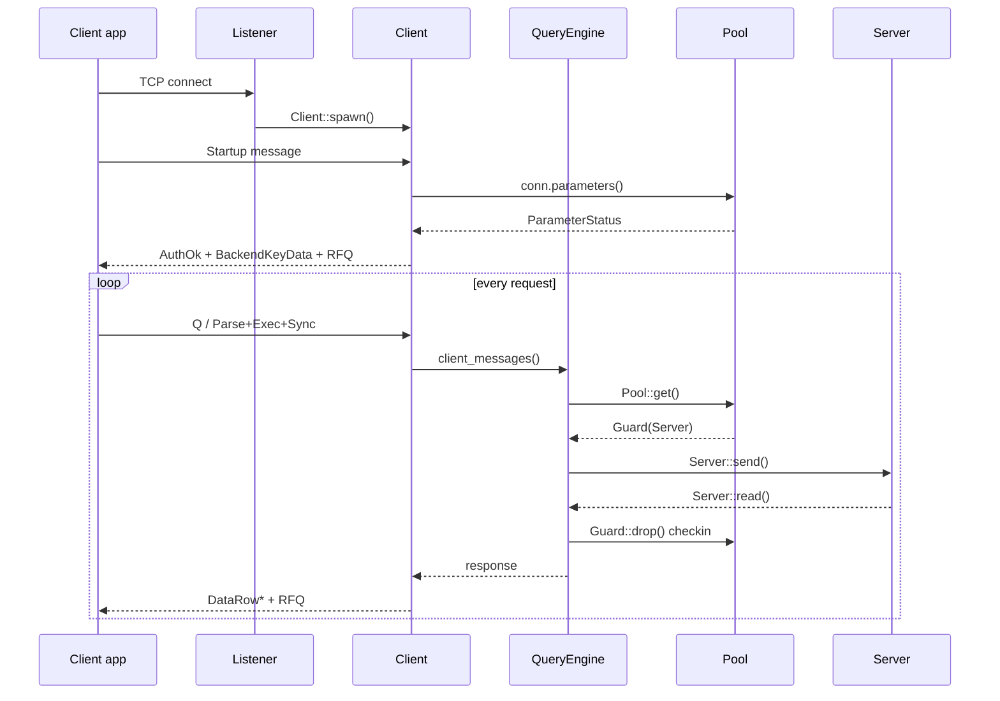
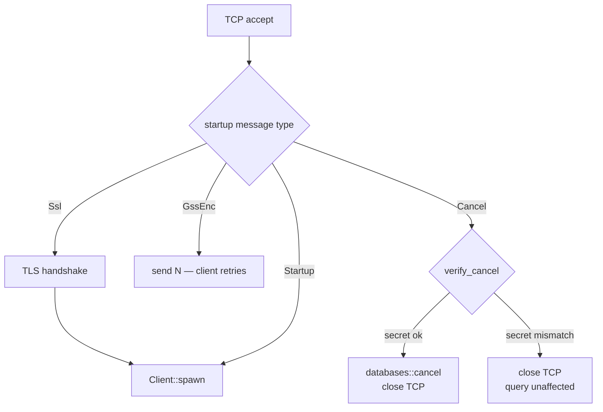
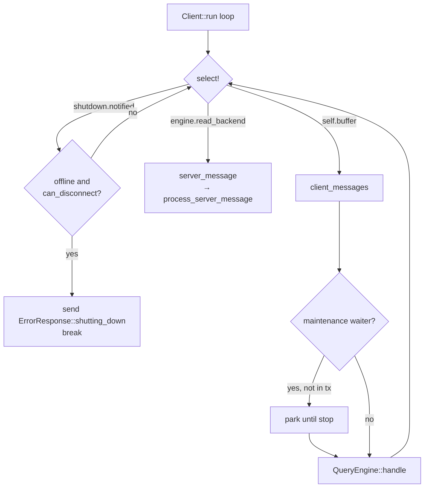
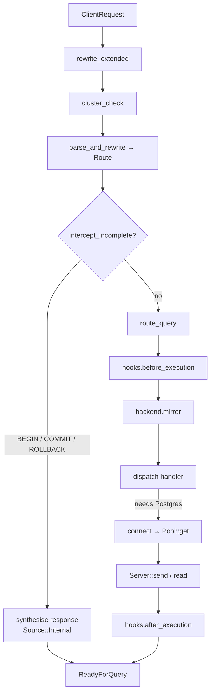
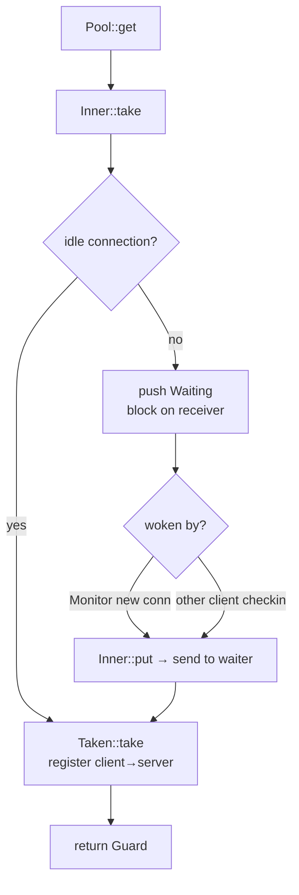
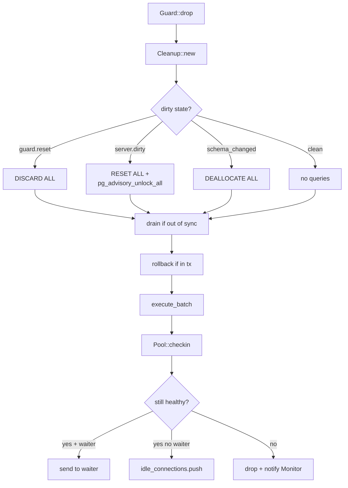
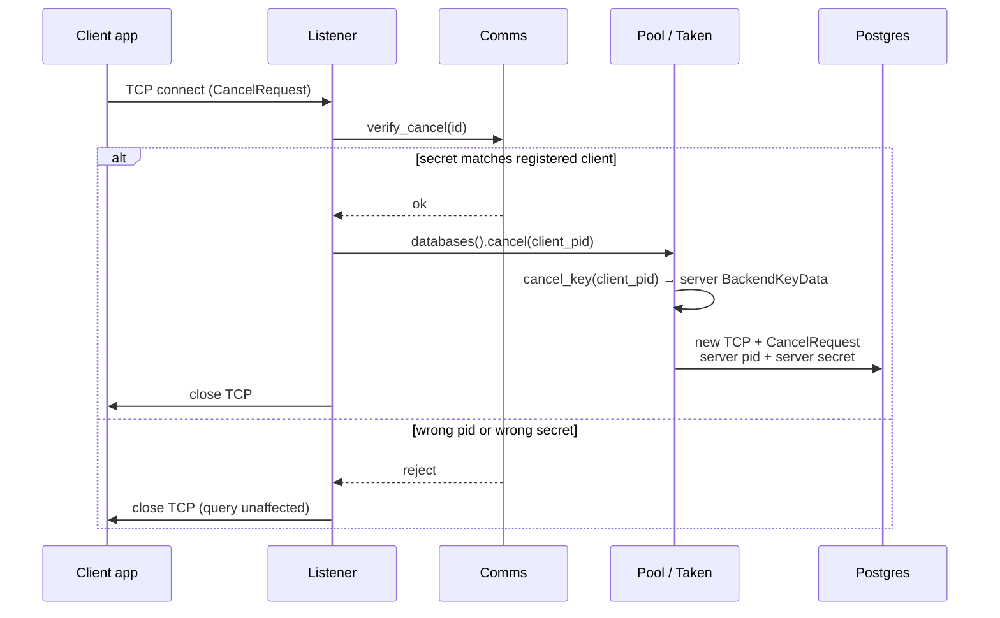

# Client connection lifecycle

This document describes a PostgreSQL client message handling through pgdog, from the TCP accept to the response returned to the client.

pgdog is a connection pooler and query router. Clients connect to it using the PostgreSQL wire protocol. pgdog speaks the protocol on both sides and maintains a pool of backend server connections.

---

## Key concepts

**`FrontendPid` — client connection identity.** `FrontendPid(i32)` ([`net/messages/frontend_pid.rs`](../pgdog/src/net/messages/frontend_pid.rs)) identifies the initiator of a checkout: clients, admin sessions, mirrors, pub/sub listeners, or replication workers. A monotonic counter assigns it, and it is written into the client's `BackendKeyData` (`K` message) so the client can return it in a `CancelRequest`.

**`BackendPid` — server connection identity.** `BackendPid { seq: u64, pid: i32 }` ([`net/messages/backend_pid.rs`](../pgdog/src/net/messages/backend_pid.rs)) identifies a server connection. `pid` is the Postgres backend pid from the handshake; `seq` is a pgdog-assigned counter that keeps the pair unique when two Postgres instances issue the same pid. `FrontendPid` and `BackendPid` are distinct types: cancel routing, the stats map, and omni-shard deduplication key on them, so the compiler prevents substituting one for the other.

**`Source` — message origin.** Each `Message` ([`net/messages/mod.rs`](../pgdog/src/net/messages/mod.rs)) carries a `Source`: `Backend(BackendPid)` for a message from a Postgres socket, `Frontend` for a message from the client, and `Internal` (the default) for a message produced by pgdog. The `Debug` formatter uses it to disambiguate byte codes that differ by direction; `D` is `Describe` from a client and `DataRow` from a server.

**`Guard` — RAII pool checkout.** `Guard` ([`backend/pool/guard.rs`](../pgdog/src/backend/pool/guard.rs)) wraps a `Box<Server>` with `Deref`/`DerefMut`. Its `Drop` implementation performs cleanup and check-in. When a `Guard` leaves scope, the connection is returned to the pool or closed.

**`Route` — routing decision.** For each query the engine produces a `Route` ([`frontend/router/parser/route.rs`](../pgdog/src/frontend/router/parser/route.rs)) specifying the target shard(s), the role (primary or replica), and merge metadata for multi-shard results. Subsequent processing operates on the `Route` and does not re-inspect the SQL.

**`ClientRequest` — extended-protocol buffer.** The extended protocol arrives as a sequence (Parse → Bind → Describe → Execute → Sync). pgdog buffers it into a `ClientRequest` ([`frontend/client_request.rs`](../pgdog/src/frontend/client_request.rs)) and dispatches once the sequence completes (Sync or Flush). A Simple Query (`Q`) is dispatched immediately.

**`Sticky` — per-client routing pins.** `Sticky` ([`frontend/client/sticky.rs`](../pgdog/src/frontend/client/sticky.rs)) holds two values assigned at login: `omni_index` (a random value that pins all of a client's omni-shard queries to one shard — per client, not per statement) and `role` (from the `pgdog.role` startup parameter). Both are assigned once and do not change.

---

## High-level flow



---

## 1. Connection acceptance

Entry point: `Listener::listen()` in [`frontend/listener.rs`](../pgdog/src/frontend/listener.rs).

Each accepted TCP socket becomes a Tokio task in `handle_client()`. Before constructing a `Client`, the listener resolves the startup type.



- **SSL** (`Startup::Ssl`): wraps the socket in TLS and records the peer certificate for mTLS authentication.
- **GSS** (`Startup::GssEnc`): not supported. pgdog sends `N` and the client retries.
- **Cancel** (`Startup::Cancel`): the listener calls `comms().verify_cancel(id)` first. On mismatch, the TCP connection is closed and the running query is unaffected; no error is returned. On success, `databases().cancel(FrontendPid::from(id))` is called and the connection is closed. This occurs before any `Client` exists, which is why the cancel path is separate from the query path.
- **Startup** (`Startup::Startup`): negotiation complete. Control falls through to `Client::spawn()`.

The socket is wrapped in `Stream` ([`net/stream.rs`](../pgdog/src/net/stream.rs)), which exposes a single `send` / `read` / `flush` interface over both plain TCP and TLS.

---

## 2. Login

`Client::login()` in [`frontend/client/mod.rs`](../pgdog/src/frontend/client/mod.rs). Runs once per connection and returns a `Client` or sends an error.

Steps, in order:

1. Reject plaintext connections when `tls_client_required` is set.
2. Resolve the target database and user from the startup parameters, and detect admin connections.
3. Assign `BackendKeyData` ([`net/messages/backend_key.rs`](../pgdog/src/net/messages/backend_key.rs)) — synthetic pid and random secret — and create a `ClientComms` ([`frontend/comms.rs`](../pgdog/src/frontend/comms.rs)).
4. Authenticate using the method configured for the user: Trust, MD5, SCRAM, Plaintext, or mTLS (via `stream.tls_identity()`). Passthrough auth forwards the credentials to Postgres.
5. Send `AuthenticationOk`.
6. Reject the connection if the pooler is shutting down (`comms.offline()`) and the connection is not an admin connection.
7. Retrieve server parameters from a pooled backend via `conn.parameters(&Request::unrouted(id))` (`id` is the connection's `FrontendPid`) and forward them as `ParameterStatus` messages.
8. Send `BackendKeyData` to the client (retained for later cancel requests).
9. Send `ReadyForQuery(Idle)`.
10. Call `comms.connect(id, addr, &params)` ([`frontend/comms.rs`](../pgdog/src/frontend/comms.rs)) to register the client in the process-wide map used for cancel routing and shutdown.

`Sticky` ([`frontend/client/sticky.rs`](../pgdog/src/frontend/client/sticky.rs)) is initialised here via `Sticky::from_params(&params)`.

---

## 3. Main client loop

`Client::run()` in [`frontend/client/mod.rs`](../pgdog/src/frontend/client/mod.rs).

```rust
loop {
    select! {
        _ = shutdown.notified()           => { /* check offline + can_disconnect */ }
        message = engine.read_backend()   => server_message(message)
        buffer  = self.buffer(state)      => client_messages(buffer)
    }
}
```



### Shutdown arm

`shutdown` is an `Arc<Notify>` from `comms.shutting_down()` ([`frontend/comms.rs`](../pgdog/src/frontend/comms.rs)). When it fires, the loop checks `comms.offline() && query_engine.can_disconnect()`. If both hold, it sends `ErrorResponse::shutting_down()` and exits. Otherwise it continues until the current transaction completes.

### Backend push arm

`engine.read_backend()` reads from a checked-out server connection. This covers any server-pushed message, not only `NOTIFY`. Each message flows through `server_message()` → `query_engine.process_server_message()` ([`frontend/client/query_engine/mod.rs`](../pgdog/src/frontend/client/query_engine/mod.rs)), which handles streaming flags, explain traces, `ReadyForQuery` transitions, 2PC finalisation, and stats.

### Client buffer arm

`self.buffer(client_state)` reads bytes from the client socket into a `ClientRequest` ([`frontend/client_request.rs`](../pgdog/src/frontend/client_request.rs)). A request is complete (`ClientRequest::is_complete()`) when the last message code is one of `{H, S, Q, c, f, F}`, or when a `CopyData` chunk reaches 4 KB. `'X'` (Terminate) triggers a graceful disconnect.

### Maintenance mode

Before dispatching, `client_messages()` checks `maintenance_mode::waiter(&database)` ([`backend/maintenance_mode.rs`](../pgdog/src/backend/maintenance_mode.rs)). If a waiter is active and the client is not in a transaction, the client parks until `maintenance_mode::stop()` fires.

### Pipeline splicing

When a client pipelines multiple extended-protocol requests in one buffer, `ClientRequest::spliced()` ([`frontend/client_request.rs`](../pgdog/src/frontend/client_request.rs)) splits them at `Execute` boundaries. Each sub-request runs through `QueryEngine::handle()` independently. A server error mid-pipeline skips forward to the next `Sync`.

---

## 4. Query engine

`QueryEngine::handle()` in [`frontend/client/query_engine/mod.rs`](../pgdog/src/frontend/client/query_engine/mod.rs).



The pre-dispatch pipeline, all within `QueryEngine::handle()`:

| Step | Method | Description |
|---|---|---|
| 1 | `rewrite_extended()` | Rewrites Parse/Bind for sharding (for example, injects the shard key into the parameter list) |
| 2 | `cluster_check()` | Verifies the cluster is online and not in maintenance |
| 3 | `parse_and_rewrite()` | Parses SQL, extracts the shard key, builds `Route`, and rewrites the query if needed |
| 4 | `intercept_incomplete()` | Answers `BEGIN`/`COMMIT`/`ROLLBACK` without contacting Postgres |
| 5 | `route_query()` | Finalises shard selection and primary/replica choice |
| 6 | `hooks.before_execution()` | `QueryEngineHooks` extension point |
| 7 | `backend.mirror()` | Queues shadow traffic to mirror pools |
| 8 | dispatch | Calls the command handler |

### Lazy backend connection

`connect()` in [`frontend/client/query_engine/connect.rs`](../pgdog/src/frontend/client/query_engine/connect.rs) is called from within the command handlers (`execute()`, `connect_transaction()`), not at the top of `handle()`. Queries the engine answers directly — `BEGIN`, `COMMIT`, `ROLLBACK`, `DISCARD`, SET — do not touch the pool.

`connect()` returns a `bool`: `false` is recoverable (no server available; the engine synthesises an error), `true` is connected, and `Err` is fatal.

### Synthesised responses

Messages produced by pgdog carry `Source::Internal` ([`net/messages/mod.rs`](../pgdog/src/net/messages/mod.rs)), which distinguishes synthesised messages from Postgres responses throughout the codebase.

### Hooks

`QueryEngineHooks` in [`frontend/client/query_engine/hooks/mod.rs`](../pgdog/src/frontend/client/query_engine/hooks/mod.rs) defines five callbacks: `before_execution`, `after_connected`, `after_execution`, `on_server_message`, and `on_engine_error`. The current built-in implementation is schema-change detection in [`frontend/client/query_engine/hooks/schema.rs`](../pgdog/src/frontend/client/query_engine/hooks/schema.rs), which marks `schema_changed` on the server so cleanup issues `DEALLOCATE ALL`.

### Two-phase commit

`TwoPc` in [`frontend/client/query_engine/two_pc/mod.rs`](../pgdog/src/frontend/client/query_engine/two_pc/mod.rs) coordinates distributed transactions across shards. When a write transaction ends with `two_pc_enabled && !rollback`, `phase_one()` issues fsync-safe `PREPARE TRANSACTION` on every shard, then `phase_two()` issues fsync-safe `COMMIT PREPARED`. The WAL in [`frontend/client/query_engine/two_pc/wal/`](../pgdog/src/frontend/client/query_engine/two_pc/wal/) records `Begin` before the prepare, `Committing` before the commit, and `End` on clean completion. Format: `u32 bodylen LE | u32 crc32c LE | u8 tag | rmp-serde body`. Tags are stable; the format evolves via `#[serde(default)]`.

---

## 5. Backend connection checkout

`connect()` in [`frontend/client/query_engine/connect.rs`](../pgdog/src/frontend/client/query_engine/connect.rs) calls through `Connection::connect()` → `cluster.primary()` or `cluster.replica()` → `Pool::get()` in [`backend/pool/pool_impl.rs`](../pgdog/src/backend/pool/pool_impl.rs).



**Fast path** (`Inner::take()` in [`backend/pool/inner.rs`](../pgdog/src/backend/pool/inner.rs)): pops a server from `idle_connections`, registers it in `Taken`, and returns it as a `Guard`.

**Slow path** (`Waiting` in [`backend/pool/inner.rs`](../pgdog/src/backend/pool/inner.rs)): when no idle connection exists, a `Waiting` struct with a oneshot channel is pushed onto `Inner::waiting`. The caller blocks on the receiver until `Monitor` creates a connection or another client checks one back in.

`Guard` ([`backend/pool/guard.rs`](../pgdog/src/backend/pool/guard.rs)) wraps `Box<Server>` with `Deref`/`DerefMut`. Its `Drop` spawns a cleanup task bounded by `rollback_timeout`; on timeout the server is marked `ForceClose`. The pool is always notified on return.

**Multi-shard**: for queries targeting multiple shards, `Binding::MultiShard` in [`backend/pool/connection/binding.rs`](../pgdog/src/backend/pool/connection/binding.rs) holds one `Guard` per shard alongside a `MultiShard` state machine.

### The `Taken` maps

`Taken` in [`backend/pool/taken.rs`](../pgdog/src/backend/pool/taken.rs) answers two questions: which server a client is using, and what its Postgres-issued cancel key is. Cancel routing reads `frontend_to_cancel` directly; the reverse map exists so that check-in, which knows the `BackendPid` but not the `FrontendPid`, can locate the entry to drop. The identity comparison in `check_in` uses the full `BackendPid` (including `seq`) to guard against the deferred-check-in race, in which a frontend takes a different server before the previous check-in completes.

| Map | Key → Value | Purpose |
|---|---|---|
| `frontend_to_cancel` | `FrontendPid` → `Checkout { server: BackendPid, cancel: BackendKeyData }` | Cancel routing: client identity → server credential (Postgres pid + secret) |
| `backend_to_frontend` | `BackendPid` → `FrontendPid` | Reverse lookup so `check_in(BackendPid)` can drop the correct `frontend_to_cancel` entry |

### Monitor

`Monitor` in [`backend/pool/monitor.rs`](../pgdog/src/backend/pool/monitor.rs) runs four loops: maintenance every 333 ms (close idle/old connections, create when undersized), health checks (`SELECT 1` on idle connections), connection creation on demand, and token refresh for external auth (RDS IAM, Azure AD).

---

## 6. Sending to and receiving from Postgres

Both directions pass through `Connection` → `Binding` ([`backend/pool/connection/binding.rs`](../pgdog/src/backend/pool/connection/binding.rs)) → `Guard` ([`backend/pool/guard.rs`](../pgdog/src/backend/pool/guard.rs)) → `Server` ([`backend/server.rs`](../pgdog/src/backend/server.rs)).

### Sending

`Server::send()` in [`backend/server.rs`](../pgdog/src/backend/server.rs) marks state `Active`, calls `send_one()` per message, then `flush()`. Each message first passes through `PreparedStatements::handle()` ([`backend/prepared_statements.rs`](../pgdog/src/backend/prepared_statements.rs)):

- A `Parse` already in the cache is dropped, and a synthetic `ParseComplete` is queued. Neither Postgres nor the client sees it.
- A `Bind` for a cached statement may have a `Parse` prepended if the statement must be re-established on this connection.
- Other messages update the in-flight state machine.

State transitions to `ReceivingData` after the flush.

### Receiving

`Server::read()` in [`backend/server.rs`](../pgdog/src/backend/server.rs) reads from the Postgres socket, tags each message `.backend(self.id)` (`Source::Backend(BackendPid)`, where `self.id` is the process-unique `BackendPid` recorded at connect time), then passes it through `PreparedStatements::forward()` ([`backend/prepared_statements.rs`](../pgdog/src/backend/prepared_statements.rs)). `forward()` drives a `ProtocolState` machine that returns `Ignore` or `Forward` per code:

- `ParseComplete ('1')` — marks the statement prepared in the cache; forwarded.
- `RowDescription ('T')` — caches the row description; forwarded.
- `ErrorResponse ('E')` — clears in-flight parses and describes; forwarded.
- `Ignore` messages are consumed silently.

This is the only place `Source::Backend` is set.

### Multi-shard receive

`MultiShard::forward()` in [`backend/pool/connection/multi_shard/mod.rs`](../pgdog/src/backend/pool/connection/multi_shard/mod.rs) aggregates messages from all shard connections:

- `RowDescription ('T')`: validated for consistency across shards, then de-duplicated.
- `DataRow ('D')`: buffered per shard; for `Route::Omni`, only one shard's rows are kept.
- `CommandComplete ('C')`: counts accumulate per shard; a synthetic `CommandComplete` with `Source::Internal` is emitted once every shard reports.
- `ReadyForQuery ('Z')`: waits for all shards, and synthesises an error state if any shard errored.

---

## 7. Connection check-in

When `Guard` ([`backend/pool/guard.rs`](../pgdog/src/backend/pool/guard.rs)) drops, `Guard::cleanup()` runs in a spawned task bounded by `rollback_timeout`.



1. **`Cleanup::new()`** in [`backend/pool/cleanup.rs`](../pgdog/src/backend/pool/cleanup.rs) — determines what to run:
   - `guard.reset` → `DISCARD ALL`
   - `server.dirty()` → `RESET ALL` + `SELECT pg_advisory_unlock_all()`
   - `server.schema_changed()` → `DEALLOCATE ALL`
   - otherwise → nothing
   - always: `server.ensure_prepared_capacity()` selects statements to CLOSE to stay within the limit.
2. **`Server::drain()`** in [`backend/server.rs`](../pgdog/src/backend/server.rs) — discards buffered Postgres data if the connection is out of sync.
3. **`Server::rollback()`** in [`backend/server.rs`](../pgdog/src/backend/server.rs) — sends `ROLLBACK` if a transaction is open.
4. **`Server::execute_batch()`** in [`backend/server.rs`](../pgdog/src/backend/server.rs) — runs the cleanup queries.
5. **`Server::sync_prepared_statements()`** in [`backend/server.rs`](../pgdog/src/backend/server.rs) — reconciles the local cache against `pg_prepared_statements`.
6. **`Pool::checkin(server)`** → `Inner::maybe_check_in()` in [`backend/pool/inner.rs`](../pgdog/src/backend/pool/inner.rs):
   - Removes the entry from `Taken` ([`backend/pool/taken.rs`](../pgdog/src/backend/pool/taken.rs)).
   - Checks: error state, offline/paused, age ≥ `effective_max_age`, `force_close`, replication mode.
   - Healthy: `Inner::put()` hands it to a waiter or pushes it to `idle_connections`.
   - Unhealthy: dropped, and `Monitor` ([`backend/pool/monitor.rs`](../pgdog/src/backend/pool/monitor.rs)) is notified.

The timeout ensures a stuck `ROLLBACK` or `DISCARD` does not starve the next waiting client.

---

## 8. Cancel flow

Cancel requests arrive on a fresh TCP connection, with no authentication and no `Client` struct. The path is implemented in [`frontend/listener.rs`](../pgdog/src/frontend/listener.rs) and [`backend/pool/`](../pgdog/src/backend/pool/):



1. `Startup::Cancel { id }` is parsed in [`frontend/listener.rs`](../pgdog/src/frontend/listener.rs).
2. `comms().verify_cancel(id)` in [`frontend/comms.rs`](../pgdog/src/frontend/comms.rs) looks up `ConnectedClient.key` by `FrontendPid::from(id)` and compares secrets. On mismatch, the connection is closed and **the running query is unaffected**; no signal reaches the backend. The secret check is the only guard: `Taken` is keyed on `FrontendPid` and `BackendPid`, not raw pids, so the secret is the sole protection against an attacker who knows a client's pid.
3. `databases().cancel(FrontendPid::from(id))` routes through cluster → shard → `LoadBalancer::cancel` ([`backend/pool/lb/mod.rs`](../pgdog/src/backend/pool/lb/mod.rs), which fans out to every target) → `Pool::cancel(client_pid: FrontendPid)` in [`backend/pool/pool_impl.rs`](../pgdog/src/backend/pool/pool_impl.rs).
4. `Inner::cancel_key(client_pid: FrontendPid)` → `Taken::cancel_key(client_pid)` → `frontend_to_cancel.get(&client_pid)` in [`backend/pool/taken.rs`](../pgdog/src/backend/pool/taken.rs) returns the `&BackendKeyData` from the `Checkout` entry (the Postgres pid and secret). Missing entries are skipped silently, which makes fan-out across shards and replicas safe.
5. `Server::cancel(addr, key)` in [`backend/server.rs`](../pgdog/src/backend/server.rs) opens a new TCP connection to Postgres and sends the `CancelRequest` with the server's pid and secret.

The client's secret (step 2) verifies that the cancel is legitimate. The server's secret (step 5) is what Postgres acts on.

---

## Source tagging summary

| Variant | Set where | Meaning |
|---|---|---|
| `Backend(BackendPid)` | [`backend/server.rs`](../pgdog/src/backend/server.rs) — one place | Arrived verbatim from a Postgres socket |
| `Frontend` | [`frontend/client/mod.rs`](../pgdog/src/frontend/client/mod.rs) — one place | Arrived from the client TCP socket |
| `Internal` | default on `Message::new()` in [`net/messages/mod.rs`](../pgdog/src/net/messages/mod.rs) | Synthesised or transformed by pgdog |

`Source` has two uses: disambiguating shared byte codes in the `Debug` formatter ([`net/messages/mod.rs`](../pgdog/src/net/messages/mod.rs)), and selecting which shard's `DataRow` to keep in `MultiShard` ([`backend/pool/connection/multi_shard/mod.rs`](../pgdog/src/backend/pool/connection/multi_shard/mod.rs)). No other production code reads it.
