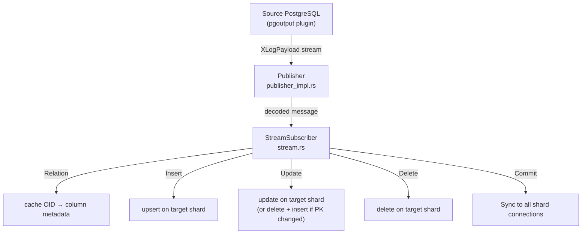
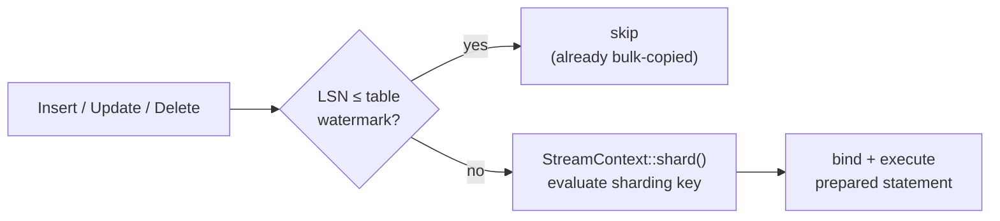
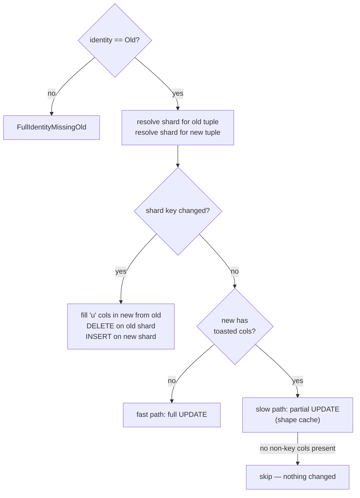
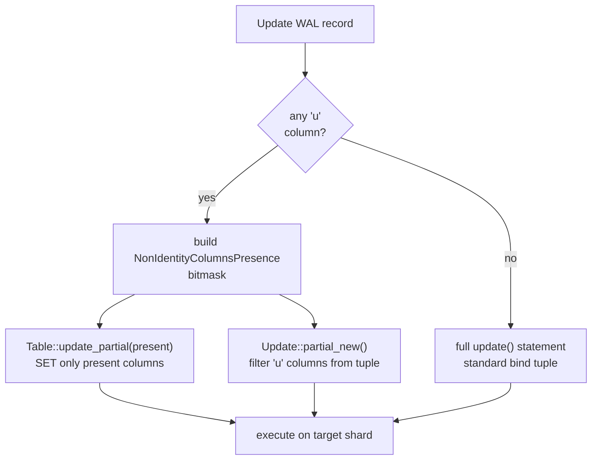

# Logical Replication — Implementation

PgDog's logical replication engine reads a PostgreSQL WAL stream, routes each change to the
correct destination shard, and executes it as a prepared statement. It is used in two places:
as Step 5 of the resharding pipeline (see [RESHARDING.md](./RESHARDING.md)), and as a standalone
`data-sync --sync-only` operation.

---

## Key modules

**`Publisher`** ([`publisher/publisher_impl.rs`](../pgdog/src/backend/replication/logical/publisher/publisher_impl.rs))
owns the replication slot lifecycle and drives the top-level read loop. It opens a streaming
replication connection to the source, forwards decoded `XLogPayload` messages to `StreamSubscriber`,
and tracks per-table lag for the cutover logic.

**`StreamSubscriber`** ([`subscriber/stream.rs`](../pgdog/src/backend/replication/logical/subscriber/stream.rs))
is the stateful message processor. It holds a prepared `Statements` set per table OID (generated
once, reused for every message), per-table LSN watermarks that gate out rows already bulk-copied
in Step 3, and one persistent connection per destination shard.

**`Table`** ([`publisher/table.rs`](../pgdog/src/backend/replication/logical/publisher/table.rs))
holds schema metadata for one replicated table and generates the four SQL statement shapes —
`insert()`, `update()`, `update_partial(present)`, `delete()` — each produced once and cached.
Parameter numbering (`$1`, `$2`, …) follows original column order so bind tuples match without
reordering.

**`StreamContext`** ([`subscriber/context.rs`](../pgdog/src/backend/replication/logical/subscriber/context.rs))
extracts the sharding key from a WAL tuple and routes it through the same `ContextBuilder` →
`Context::apply()` pipeline used for live queries, ensuring WAL rows land on the same shard as
application writes would.

---

## WAL message flow



Every `Insert`, `Update`, and `Delete` passes through a three-step gate before reaching
the destination:



The execution path after that gate depends on the table's **replica identity**, described in
the sections below.

---

## REPLICA IDENTITY DEFAULT and INDEX

`REPLICA IDENTITY DEFAULT` uses the primary key columns as the row identity.
`REPLICA IDENTITY USING INDEX` uses the columns of a nominated unique index.
In both cases, PostgreSQL writes only those identity columns into UPDATE and DELETE WAL
records — not the full row.

### What it means for row matching

The identity columns are guaranteed NOT NULL — primary key columns by definition, and
`REPLICA IDENTITY USING INDEX` requires NOT NULL on every indexed column.

This has a direct consequence for statement shape:

- The WHERE clause in UPDATE and DELETE uses plain `=` predicates. NULL can never appear
  in identity columns, so `=` always behaves correctly.
- The sharding key is extracted directly from the event tuple: identity columns for
  UPDATE/DELETE, all columns for INSERT.
- Each event routes to exactly one destination shard — no broadcast.

### Statement shapes

`Table` in [`publisher/table.rs`](../pgdog/src/backend/replication/logical/publisher/table.rs)
prepares the following statement shapes at `relation()` time:

| Operation | Statement shape |
|---|---|
| INSERT (sharded) | Plain `INSERT` |
| INSERT (omni) | `INSERT … ON CONFLICT (identity_cols) DO UPDATE SET …` |
| UPDATE | `UPDATE … SET non_identity_cols = $N WHERE identity_cols = $M` |
| UPDATE (partial) | Same WHERE, SET restricted to non-Toasted columns — shape-cached |
| DELETE | `DELETE … WHERE identity_cols = $N` |

The partial UPDATE path is covered in detail in
[Handling unchanged-TOAST columns](#handling-unchanged-toast-columns).

---

## REPLICA IDENTITY FULL

`REPLICA IDENTITY FULL` is used on tables with no primary key or suitable unique index.
Instead of writing only key columns into UPDATE and DELETE WAL records, PostgreSQL writes
the entire pre-change row. PgDog detects this at `relation()` time
(`ReplicaIdentity.identity == "f"`) and sets a per-OID `full_identity` flag; all subsequent
events for that table are dispatched to dedicated handlers in `subscriber/stream.rs`.

### Sharded vs omni

The behavior splits on whether the table has a sharding column:

- *Sharded FULL* tables route via the sharding-key value in the OLD tuple (UPDATE/DELETE)
  or the NEW tuple (INSERT). No broadcast is needed.
- *Omni FULL* tables replicate to every shard. Because omni INSERTs fan out during the
  bulk-copy/replication overlap window, duplicates are possible. PgDog requires a
  **unique index that prevents NULL-keyed duplicates** on every destination shard. Either
  declare every key column `NOT NULL`, or use a PG15+ `NULLS NOT DISTINCT` unique index.
  A standard nullable unique index allows two `NULL`-keyed rows to coexist, which corrupts
  the destination row count during the overlap window. If any shard lacks a usable index,
  `connect()` rejects the stream with a clear error before streaming begins.

### INSERT

A plain `INSERT` for sharded tables. Omni tables use `INSERT … ON CONFLICT DO NOTHING`
(`upsert_full_identity` in `publisher/table.rs`), silently skipping rows that already
landed from the COPY phase.

### UPDATE

OLD and NEW tuples are routed through the query router independently to detect whether the
sharding key changed:



#### Single-row targeting with `(tableoid, ctid)`

FULL identity DELETE and UPDATE use a `(tableoid, ctid)` subquery instead of a bare predicate:

```sql
-- what we emit
WHERE (tableoid, ctid) = (SELECT tableoid, ctid FROM t WHERE col IS NOT DISTINCT FROM $1 AND … LIMIT 1)

-- what we avoid
WHERE col1 IS NOT DISTINCT FROM $1 AND col2 IS NOT DISTINCT FROM $2 AND …
```

**`ctid` is a physical address `(block, offset)` within a heap.** On a plain table this is
globally unique: one file, one address space. On a partitioned destination table each partition
is its own heap, and every heap starts its address space at `(0,1)`. Two partitions can both have
a live row at `(0,1)`. A bare `WHERE ctid = (SELECT ctid … LIMIT 1)` would expand across all
partitions in the outer DML and delete or update every partition that happens to have a row at
that address — not the one row we wanted.

**`tableoid`** is the OID of the heap the row physically lives in — for a partitioned parent,
the specific leaf partition. `(tableoid, ctid)` is unique across the entire partition tree.
The outer `WHERE (tableoid, ctid) = (…)` Postgres row-constructor comparison pins both the
partition and the physical slot simultaneously, so only the single identified row is touched.
On a non-partitioned table `tableoid` is constant for the whole relation; the extra column adds
no overhead and does not change behaviour.

**Why the subquery also helps with duplicates.** `LIMIT 1` lets the sequential scan stop at the
first matching row (expected depth N/2 for N rows), and the outer Tid Scan fetches that exact
page by physical address in a single buffer pin. Without the subquery a bare predicate is a full
table scan that modifies *every* matching row — incorrect when the destination contains
byte-for-byte duplicate rows (possible during the copy–stream overlap window).

**When the destination has an index.** Omni FULL tables require a unique index on every
destination shard. Because that index must have all key columns `NOT NULL` (or use
`NULLS NOT DISTINCT`), the planner can treat `col IS NOT DISTINCT FROM $1` as plain `=`
for those columns and use the index for the inner subquery — changing the inner scan from
O(N) sequential to O(log N). Sharded FULL tables have no such requirement and typically
no index, so the scan remains sequential with `LIMIT 1` stopping it early.

**Sharded vs omni.** For sharded tables the statement is sent to exactly one shard.
For omni tables the same bind is sent to every shard; each shard runs the subquery
independently against its own copy of the table and gets back its own `(tableoid, ctid)`.
The approach is correct on both: `tableoid` and `ctid` are local to the shard that produced them.

`IS NOT DISTINCT FROM` is used rather than `=` because FULL identity columns have no NOT NULL
guarantee — `col = NULL` is always unknown in SQL and would silently match zero rows.
DEFAULT/INDEX identity uses plain `=`; its identity columns are guaranteed NOT NULL.

#### Cross-shard key change

When OLD and NEW route to different shards, a single `UPDATE` cannot span both.
PgDog detects this by comparing the shard resolved from each tuple.

This has direct consequences for how the event is applied:

- PgDog falls back to a DELETE on the old shard followed by an INSERT on the new shard.
- If `update.new` contains unchanged-TOAST (`'u'`) columns, PgDog fills them in from
  `old_full` before constructing the INSERT bind. With FULL identity, `old_full` is always
  fully materialised, so every `'u'` column has its value available at the same position.

### DELETE

PostgreSQL fetches TOAST values before writing DELETE WAL records, so `delete.old` always
carries fully materialized column values — `'u'` markers never appear.

The WHERE clause uses the same `(tableoid, ctid)` subquery pattern as UPDATE: `IS NOT DISTINCT FROM`
on all columns, wrapped in `(SELECT tableoid, ctid … LIMIT 1)` to delete exactly one row even when
the destination contains duplicate rows that are byte-for-byte identical, or when the destination
is a partitioned table where bare `ctid` values are not unique across partitions.

### Errors

| Error | When | Recovery |
|---|---|---|
| `FullIdentityMissingOld` | UPDATE/DELETE arrives without a full OLD tuple | source replica identity changed; re-validate and restart |
| `FullIdentityOmniNoUniqueIndex` | Omni table missing a qualifying unique index on any shard | add a unique index with all key columns `NOT NULL`, or a PG15+ `NULLS NOT DISTINCT` unique index |

---

## Handling unchanged-TOAST columns

PostgreSQL stores large values out-of-line in a TOAST table. When an UPDATE touches a row but
leaves a large column unchanged, PostgreSQL omits that column's data from the WAL record and
emits a `'u'` (unchanged) marker in its place. A replication consumer that ignores this and sends
the empty slot to the destination will silently overwrite a valid large value with nothing.

### What the tuple looks like

Consider a table with one large column:

```sql
CREATE TABLE posts (
    id    bigint PRIMARY KEY,
    title text,
    body  text   -- large value stored out-of-line via TOAST
);
```

An `UPDATE posts SET title = 'new title' WHERE id = 1` only touches `title`. PostgreSQL has no
reason to re-read `body` from the TOAST table, so the WAL record for the new tuple arrives as:

```
id    → 't'  value: 1           (text — present)
title → 't'  value: 'new title' (text — present)
body  → 'u'                     (unchanged TOAST — no data)
```

An `UPDATE posts SET body = '...' WHERE id = 1` touches `body`, so both non-identity columns are
fully present:

```
id    → 't'  value: 1     (text — present)
title → 't'  value: '...' (text — present)
body  → 't'  value: '...' (text — present)
```

The key point: **the presence pattern is determined at write time by the application**, not at
schema-load time. Any column that was not modified in a given UPDATE may arrive as `'u'`, so the
engine cannot assume a fixed shape for any table.

### How PgDog handles it

PgDog handles it with a partial UPDATE, keyed on which columns are actually present:



`NonIdentityColumnsPresence` ([`publisher/non_identity_columns_presence.rs`](../pgdog/src/backend/replication/logical/publisher/non_identity_columns_presence.rs))
is a compact bitmask with one bit per non-identity column, set when the column is present (not
toasted). It drives both the SQL generation and the bind tuple, and it doubles as the cache key
for prepared statements.

### Statement caching by presence shape

Because the presence pattern varies per WAL record, `Table::update_partial` cannot be prepared
once at startup. Instead, each distinct bitmask gets its own prepared statement, generated on
first encounter and cached for reuse:

| WAL record | `NonIdentityColumnsPresence` | Prepared statement cached |
|---|---|---|
| `SET title = 'x'` | `{title: present, body: toasted}` | `UPDATE posts SET title = $2 WHERE id = $1` |
| `SET body = '...'` (all present) | `{title: present, body: present}` | full `update()` — standard path |
| `SET title = 'x', body = '...'` | `{title: present, body: present}` | same as above — cache hit |

A table that is always updated with all columns present will only ever use the full `update()`
statement and never enter the partial path. A table whose large columns are frequently left
unchanged will accumulate one cached statement per observed presence pattern — in practice a
small number, since most applications update columns in a consistent subset.

`Update::partial_new()` produces the SET bind tuple by filtering `'u'` columns out of the WAL
NEW tuple — no schema metadata needed, because PostgreSQL guarantees identity (primary-key)
columns are never marked `'u'`. For `REPLICA IDENTITY FULL`, PostgreSQL passes OLD through
`ExtractReplicaIdentity` → `toast_flatten_tuple` before WAL-logging, so OLD always has every
column present. The slow path keeps OLD intact for the WHERE clause (all `n` columns at
`$1..$n`) and uses `partial_new` for SET (the `k` non-Toasted columns at `$n+1..$n+k`).
`Update::full_identity_bind_tuple(&old_full, &partial_new)` then concatenates them into a
single `n+k`-parameter bind that matches the SQL emitted by `Table::update_full_identity_partial_set`.

---

## Error rollback

WAL events dispatch `Bind/Execute/Flush` (no `Sync`), leaving Postgres in an implicit
transaction that holds row locks. On `Err`, `StreamSubscriber::handle` in
[`subscriber/stream.rs`](../pgdog/src/backend/replication/logical/subscriber/stream.rs)
clears `self.connections` and resets per-session state (`relations`, `statements`, `keys`,
`changed_tables`, `in_transaction`). Dropping each `Server` closes its TCP socket;
Postgres FATALs the backend and rolls back the implicit transaction. The next call to
`handle()` lazily reconnects and rebuilds prepared statements from the Relation messages
Postgres re-emits after reconnect.

`Sync` would not work: it commits when Postgres saw no error, but PgDog raises some errors
(e.g. `FullIdentityMissingOld` on a missing OLD tuple) *after* a successful `CommandComplete`.
FATAL disconnect is the only signal that rolls back regardless. Connections come from
`Pool::standalone`, so dropping them closes the socket instead of returning to a pool.