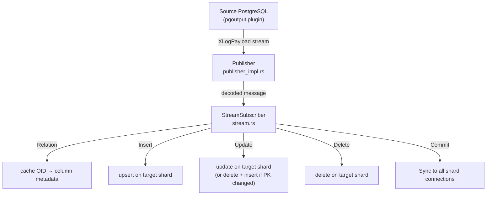
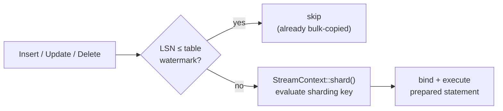
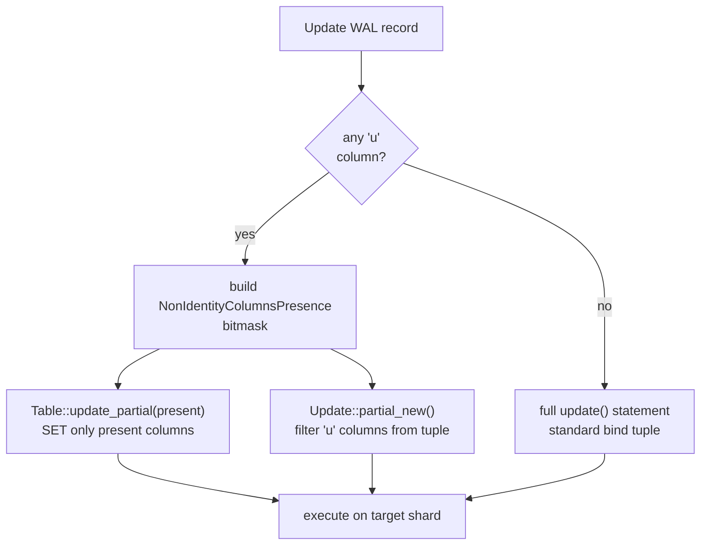

# Logical Replication — Implementation

PgDog's logical replication engine reads a PostgreSQL WAL stream, routes each change to the
correct destination shard, and executes it as a prepared statement. It is used in two places:
as Step 5 of the resharding pipeline (see [RESHARDING.md](./RESHARDING.md)), and as a standalone
`data-sync --sync-only` operation.

---

## Key modules

**`Publisher`** ([`publisher/publisher_impl.rs`](../pgdog/src/backend/replication/logical/publisher/publisher_impl.rs))
owns the replication slot lifecycle and drives the top-level read loop. It opens a streaming
replication connection to the source, forwards decoded `XLogPayload` messages to `StreamSubscriber`,
and tracks per-table lag for the cutover logic.

**`StreamSubscriber`** ([`subscriber/stream.rs`](../pgdog/src/backend/replication/logical/subscriber/stream.rs))
is the stateful message processor. It holds a prepared `Statements` set per table OID (generated
once, reused for every message), per-table LSN watermarks that gate out rows already bulk-copied
in Step 3, and one persistent connection per destination shard.

**`Table`** ([`publisher/table.rs`](../pgdog/src/backend/replication/logical/publisher/table.rs))
holds schema metadata for one replicated table and generates the four SQL statement shapes —
`insert()`, `update()`, `update_partial(present)`, `delete()` — each produced once and cached.
Parameter numbering (`$1`, `$2`, …) follows original column order so bind tuples match without
reordering.

**`StreamContext`** ([`subscriber/context.rs`](../pgdog/src/backend/replication/logical/subscriber/context.rs))
extracts the sharding key from a WAL tuple and routes it through the same `ContextBuilder` →
`Context::apply()` pipeline used for live queries, ensuring WAL rows land on the same shard as
application writes would.

---

## WAL message flow



Every `Insert`, `Update`, and `Delete` passes through the same three-step path before reaching
the destination:



---

## Handling unchanged-TOAST columns

PostgreSQL stores large values out-of-line in a TOAST table. When an UPDATE touches a row but
leaves a large column unchanged, PostgreSQL omits that column's data from the WAL record and
emits a `'u'` (unchanged) marker in its place. A replication consumer that ignores this and sends
the empty slot to the destination will silently overwrite a valid large value with nothing.

### What the tuple looks like

Consider a table with one large column:

```sql
CREATE TABLE posts (
    id    bigint PRIMARY KEY,
    title text,
    body  text   -- large value stored out-of-line via TOAST
);
```

An `UPDATE posts SET title = 'new title' WHERE id = 1` only touches `title`. PostgreSQL has no
reason to re-read `body` from the TOAST table, so the WAL record for the new tuple arrives as:

```
id    → 't'  value: 1           (text — present)
title → 't'  value: 'new title' (text — present)
body  → 'u'                     (unchanged TOAST — no data)
```

An `UPDATE posts SET body = '...' WHERE id = 1` touches `body`, so both non-identity columns are
fully present:

```
id    → 't'  value: 1     (text — present)
title → 't'  value: '...' (text — present)
body  → 't'  value: '...' (text — present)
```

The key point: **the presence pattern is determined at write time by the application**, not at
schema-load time. Any column that was not modified in a given UPDATE may arrive as `'u'`, so the
engine cannot assume a fixed shape for any table.

### How PgDog handles it

PgDog handles it with a partial UPDATE, keyed on which columns are actually present:



`NonIdentityColumnsPresence` ([`publisher/non_identity_columns_presence.rs`](../pgdog/src/backend/replication/logical/publisher/non_identity_columns_presence.rs))
is a compact bitmask with one bit per non-identity column, set when the column is present (not
toasted). It drives both the SQL generation and the bind tuple, and it doubles as the cache key
for prepared statements.

### Statement caching by presence shape

Because the presence pattern varies per WAL record, `Table::update_partial` cannot be prepared
once at startup. Instead, each distinct bitmask gets its own prepared statement, generated on
first encounter and cached for reuse:

| WAL record | `NonIdentityColumnsPresence` | Prepared statement cached |
|---|---|---|
| `SET title = 'x'` | `{title: present, body: toasted}` | `UPDATE posts SET title = $2 WHERE id = $1` |
| `SET body = '...'` (all present) | `{title: present, body: present}` | full `update()` — standard path |
| `SET title = 'x', body = '...'` | `{title: present, body: present}` | same as above — cache hit |

A table that is always updated with all columns present will only ever use the full `update()`
statement and never enter the partial path. A table whose large columns are frequently left
unchanged will accumulate one cached statement per observed presence pattern — in practice a
small number, since most applications update columns in a consistent subset.

`Update::partial_new()` produces the bind tuple by filtering `'u'` columns out of the WAL tuple
directly — no schema metadata needed, because PostgreSQL guarantees identity (primary-key) columns
are never marked `'u'`. The parameter sequence in the SQL and the bind tuple match by construction.

Re-fetching the missing value from the source is not an option: a query issued outside the
replication stream's transaction context could reflect a newer write, breaking ordering guarantees.
It is also unnecessary — the destination already holds the correct value from the initial bulk
COPY or a prior full UPDATE, so skipping the column in the SET clause is exactly right.
