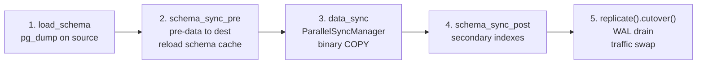

# Resharding — Implementation

This document describes how the resharding pipeline works at the code level. For the user-facing
prerequisites, step-by-step guide, and cutover configuration see
[Resharding Postgres](https://docs.pgdog.dev/features/sharding/resharding/) and the companion
blog post [Shard Postgres with one command](https://pgdog.dev/blog/shard-postgres-with-one-command).
For sharding routing internals see [SHARDING.md](./SHARDING.md).

---

## Entry point — `RESHARD` command

```sql
RESHARD <source> <destination> <publication>;
```

Issued against the admin database. Parsed in [`pgdog/src/admin/reshard.rs`](../pgdog/src/admin/reshard.rs), which calls
`Orchestrator::new(source, destination, publication, slot_name)` and then
`orchestrator.replicate_and_cutover().await`.

> **Multi-node deployments:** Traffic cutover via `RESHARD` is supported on single-node PgDog only.
> The [Enterprise Edition control plane](https://docs.pgdog.dev/enterprise_edition/control_plane/)
> is required for coordinated cutover across multiple PgDog containers.

---

## Orchestrator

`Orchestrator` in [`pgdog/src/backend/replication/logical/orchestrator.rs`](../pgdog/src/backend/replication/logical/orchestrator.rs) owns:
- `source: Cluster` / `destination: Cluster` — connection handles to the two database clusters
- `publisher: Arc<Mutex<Publisher>>` — manages replication slots, table list, and lag tracking
- `replication_slot: String` — auto-generated as `__pgdog_repl_<random19>` unless overridden

`replicate_and_cutover()` is the top-level method and calls the five steps below in sequence:



---

## Step 1 — Schema dump

`Orchestrator::load_schema()` creates a `PgDump` ([`pgdog/src/backend/schema/sync/pg_dump.rs`](../pgdog/src/backend/schema/sync/pg_dump.rs))
with the source cluster and publication name, calls `pg_dump.dump().await`, and stores the
`PgDumpOutput` on the orchestrator. This output carries pre-data (tables, types, extensions,
primary key constraints), secondary index DDL, post-cutover operations, and sequences — split
into `SyncState` phases so they can be applied in the right order later.

---

## Step 2 — Pre-data schema sync

`schema_sync_pre()` restores `SyncState::PreData` from the dump to the destination cluster, then:
1. Calls `reload_from_existing()` to refresh PgDog's in-memory schema cache so subsequent routing
   decisions reflect the new destination schema.
2. Re-fetches `source` and `destination` clusters from `databases()` (addresses may have changed
   after the reload).
3. If the destination has `RewriteMode::RewriteOmni`, installs the sharded sequence schema via
   `Schema::install()`.

> **Prerequisite:** all tables in the publication must have a primary key. `Table::valid()` in
> [`pgdog/src/backend/replication/logical/publisher/table.rs`](../pgdog/src/backend/replication/logical/publisher/table.rs) checks this and returns
> `Error::NoPrimaryKey(table)` before any data moves. Without a PK, the upsert conflict target
> is undefined and the replication stream cannot be made idempotent.

---

## Step 3 — Data sync (parallel COPY)

`Orchestrator::data_sync()` delegates to `Publisher::data_sync()`, which builds a
`ParallelSyncManager` and calls `manager.run().await`.

### ParallelSyncManager ([`publisher/parallel_sync.rs`](../pgdog/src/backend/replication/logical/publisher/parallel_sync.rs))

`ParallelSyncManager::new()` takes the table list, a set of source replica connection pools, and
the destination cluster. It sizes a `Semaphore` to
`replicas.len() × dest.resharding_parallel_copies()`. Each table is spawned as a `tokio::spawn`
task via `ParallelSync::run()`. All tasks share an `UnboundedSender`; the manager collects
completions via `rx.recv()`. Replicas are round-robined across tasks.

> **Replica isolation:** replicas tagged `resharding_only = true` in `pgdog.toml` are included
> here and excluded from normal application traffic. The `Semaphore` ensures the source replicas
> and destination shards are not overwhelmed.

> **WAL disk space:** each per-table `ReplicationSlot` created during the copy prevents PostgreSQL
> from recycling WAL on the source until the slot is drained. Estimate WAL write rate × copy
> duration and provision that headroom before starting. An orphaned slot from a failed reshard
> accumulates WAL indefinitely — drop it before retrying (see "When things go wrong" below).

### Per-table copy flow ([`Table::data_sync()`](../pgdog/src/backend/replication/logical/publisher/table.rs))

Each task performs this sequence against its assigned source replica:

1. Creates a `CopySubscriber` — opens connections to all destination shards.
2. Creates a `ReplicationSlot::data_sync()` — opens a streaming replication connection to the
   source replica.
3. `slot.create_slot()` — creates a **temporary** logical replication slot, returning the current
   LSN. This pins the WAL position atomically inside the same transaction as the copy.
4. `copy.start()` — issues `COPY table TO STDOUT (FORMAT BINARY)` on the source.
5. Streams each row through `copy_sub.copy_data(row)` — the `CopySubscriber` runs the same
   `ContextBuilder` → `Context::apply()` sharding pipeline used for live queries, and forwards
   each row to the correct destination shard(s).
6. `copy_sub.copy_done()` — sends `CopyDone` to each destination shard, flushes, disconnects.
7. `slot.start_replication()` + drain loop — replays any WAL accumulated since slot creation,
   then sends a status update confirming the slot position. The slot is `TEMPORARY` and is
   automatically dropped when the replication connection closes.
8. `COMMIT` closes the transaction on the source replica.

The recorded LSN becomes the replay watermark for that table's WAL stream in Step 5.

---

## Step 4 — Post-data schema sync

`schema_sync_post()` restores `SyncState::PostData` — secondary indexes, non-PK constraints,
and any other DDL that was deferred. Deferring index creation until after the bulk copy avoids
index maintenance overhead during the high-throughput copy phase.

---

## Step 5 — Replication and cutover

`replicate()` creates a `ReplicationWaiter` that wraps a `Waiter` from `Publisher::replicate()`.
`ReplicationWaiter::cutover()` then runs two serial wait phases followed by the atomic swap.

### Publisher and StreamSubscriber

`Publisher` in [`publisher/publisher_impl.rs`](../pgdog/src/backend/replication/logical/publisher/publisher_impl.rs) owns the replication slot, table list, and lag map.
It opens a logical replication connection to the source and streams `XLogPayload` messages to
`StreamSubscriber` in [`subscriber/stream.rs`](../pgdog/src/backend/replication/logical/subscriber/stream.rs).

`StreamSubscriber` maintains:
- `relations: HashMap<Oid, Relation>` — table OID metadata sent once per connection
- `statements: HashMap<Oid, Statements>` — one set of prepared statements per table OID,
  generated once from `Table::insert()` / `update()` / `delete()`:
  - `insert`: `INSERT INTO "schema"."table" ($1,$2,...) ON CONFLICT (pk_cols) DO UPDATE SET non_pk=$N`
  - `update`: `UPDATE "schema"."table" SET non_pk=$N WHERE pk=$M`
  - `delete`: `DELETE FROM "schema"."table" WHERE pk=$N`
- `table_lsns: HashMap<Oid, i64>` — per-table replay watermark (set from Step 3 LSNs)
- `connections: Vec<Server>` — one open connection per destination shard

**Per-message handling:**

| WAL message | Action |
|---|---|
| `Insert` | Check `lsn_applied(oid)` → if above watermark, run upsert prepared statement on correct shard |
| `Update` | PK change → decomposed into `delete(old) + insert(new)`; no PK change → `update` statement |
| `Delete` | `delete` prepared statement on correct shard |
| `Commit` | Send `Sync` to all open shard connections to close the transaction |

**LSN guard** (`lsn_applied()`): if `current_lsn ≤ table_lsns[oid]`, the row was already
bulk-copied in Step 3 and is skipped. Watermarks advance per-table on `COMMIT`.

**Omnisharded tables** (`statements.omni = true`): upsert is sent to all shards simultaneously.

**Routing**: `StreamContext::shard()` runs `ContextBuilder` + `Context::apply()` on the sharding
key column extracted from the WAL tuple — identical to the live query routing path.

### Cutover phases

**Phase 1 — `wait_for_replication()`**: polls lag every 1 second. When
`lag ≤ cutover_traffic_stop_threshold`:
1. Calls `maintenance_mode::start()` — new queries queue behind a barrier.
2. Calls `cancel_all(source_db)` — cancels any queries already in flight.

**Phase 2 — `wait_for_cutover()`**: polls at 50 ms intervals. Three independent triggers can fire
cutover (whichever comes first):

| Trigger | Config key | Action |
|---|---|---|
| `lag ≤ threshold` | `cutover_replication_lag_threshold` | `CutoverReason::Lag` → proceed |
| elapsed ≥ timeout | `cutover_timeout` | `CutoverReason::Timeout` → proceed or abort (see `cutover_timeout_action`) |
| no transactions for N ms | `cutover_last_transaction_delay` | `CutoverReason::LastTransaction` → proceed |

**Point of no return** — the `ok_or_abort!` macro wraps every subsequent call. Any failure resumes
traffic immediately via `maintenance_mode::stop()` and returns an error. Steps in order:

1. `publisher.request_stop()` + `waiter.wait()` — stops the replication stream; drains remaining WAL.
2. `schema_sync_cutover()` — applies `SyncState::Cutover` operations (e.g. drops sequences that
   won't be used in the sharded cluster).
3. `cutover(source_db, dest_db)` in [`pgdog/src/backend/databases.rs`](../pgdog/src/backend/databases.rs) — atomically swaps source and
   destination in the in-memory routing table.
4. `orchestrator.refresh()` — re-fetches both clusters from `databases()` so the orchestrator now
   treats the new cluster as source for reverse replication.
5. `schema_sync_post_cutover()` — applies `SyncState::PostCutover` (removes blockers that would
   prevent reverse replication, such as unique constraints on sequence columns).
6. `orchestrator.replicate()` — starts reverse replication (new cluster → old cluster) as a
   background `AsyncTasks` task. This enables rollback without data loss.
7. `maintenance_mode::stop()` — releases the barrier; queued and new queries flow to the new cluster.

---

## Error handling and fault tolerance

### Pre-cutover failures — plain propagation

Steps 1–4 (`load_schema`, `schema_sync_pre`, `data_sync`, `schema_sync_post`) propagate errors
with `?` directly from `replicate_and_cutover()`. Maintenance mode is never entered during these
steps. A failure here leaves traffic unaffected and the source untouched, making a full restart safe.

### Schema DDL — intentional error tolerance

`schema_sync_pre`, `schema_sync_post`, `schema_sync_cutover`, and `schema_sync_post_cutover` are
all called with `ignore_errors = true`. The `PgDumpOutput::restore()` method logs errors and
continues when this flag is set. The intent is to tolerate pre-existing objects on the destination
— a common condition when a previous reshard attempt failed mid-schema-sync and left partial DDL
behind. Re-running `RESHARD` after such a failure will not abort on `table already exists` or
similar conflicts.

### Data sync — abort propagation and cooperative cancellation

[`Table::data_sync()`](../pgdog/src/backend/replication/logical/publisher/table.rs) runs the COPY row loop under a `tokio::select!` that races two futures:
the next row from the source, and `AbortSignal::aborted()`. `AbortSignal` wraps the closed-state
of the `UnboundedSender` shared with `ParallelSyncManager` — it resolves when the channel is
dropped. If the channel closes mid-copy (e.g. because another table's task failed and the manager
is torn down), the loop returns `Error::CopyAborted`. The task does not need to be explicitly
cancelled.

[`ParallelSync::run()`](../pgdog/src/backend/replication/logical/publisher/parallel_sync.rs) checks `tx.is_closed()` before acquiring the semaphore permit. A task that
wakes after the channel is already closed returns `Error::DataSyncAborted` immediately without
starting a copy.

Error propagation from the manager: `run()` drives completion via `rx.recv()`. The first `Err`
returned by any task surfaces via `table?` and aborts the manager's loop. Remaining tasks run to
completion or abort via their own `AbortSignal`, but their results are ignored once the channel
is dropped.

### Temporary vs permanent replication slots

Per-table slots created in [`Table::data_sync()`](../pgdog/src/backend/replication/logical/publisher/table.rs) are `TEMPORARY` — PostgreSQL drops them
automatically when the replication connection closes, including on error or panic. A failed copy
task leaves no orphaned per-table slot.

The `Publisher`'s named replication slot (the one used for the WAL streaming phase) is permanent.
[`Publisher::cleanup()`](../pgdog/src/backend/replication/logical/publisher/publisher_impl.rs) drops it by calling `slot.drop_slot()`, which issues
`DROP_REPLICATION_SLOT "name" WAIT` over the replication protocol connection. `cleanup()` is an
explicit method on `Orchestrator` — it is not called automatically inside `replicate_and_cutover()`.
If the orchestrator is dropped after Step 5 begins but before `cleanup()` is called (e.g. a
process crash), the permanent slot survives and continues accumulating WAL on the source.

### The `ok_or_abort!` macro — guaranteed traffic resumption after cutover starts

```rust
macro_rules! ok_or_abort {
    ($expr:expr) => {
        match $expr {
            Ok(res) => res,
            Err(err) => {
                maintenance_mode::stop();
                cutover_state(CutoverState::Abort { error: err.to_string() });
                return Err(err.into());
            }
        }
    };
}
```

Once `maintenance_mode::start()` is called in `wait_for_replication()`, traffic is paused.
`ok_or_abort!` is the only place that calls `maintenance_mode::stop()` for the remaining steps.
Every call after the point of no return — `waiter.wait()`, `schema_sync_cutover()`, `cutover()`,
`orchestrator.refresh()`, `schema_sync_post_cutover()`, `orchestrator.replicate()` — is wrapped
in it. This guarantees traffic always resumes, regardless of which step fails.

The macro also transitions the global `CutoverState` to `Abort`, which is visible via
`SHOW REPLICATION_SLOTS` in the admin database.

### AbortTimeout — the one pre-point-of-no-return stop

When `cutover_timeout_action = "abort"` and the timeout fires in `wait_for_cutover()`, the code
explicitly calls `maintenance_mode::stop()` before returning `Err(Error::AbortTimeout)`. This is
the only code path that stops maintenance mode without being inside `ok_or_abort!` — it is the
case where the cutover was never attempted, so no data was moved and no swap occurred.

### Idempotency guarantees

Several mechanisms make it safe to replay data across a restart:

| Mechanism | Where | Effect |
|---|---|---|
| Temporary replication slots | `Table::data_sync()` | Auto-dropped on connection close; no orphaned per-table slots |
| `ignore_errors = true` | All schema sync steps | Pre-existing DDL on destination does not abort the run |
| LSN watermark guard | `StreamSubscriber::lsn_applied()` | Rows bulk-copied in Step 3 are skipped during WAL replay in Step 5 |
| Upsert on INSERT messages | `Table::insert(upsert=true)` | `ON CONFLICT (pk) DO UPDATE SET` prevents duplicates on WAL re-delivery |
| PK validation | `Table::valid()` | Fails before any data moves; restart is clean |