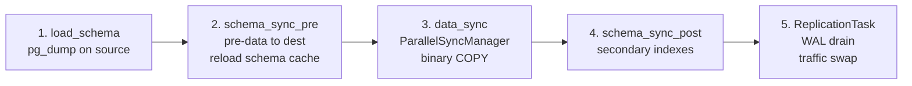

# Resharding — Implementation

This document describes how the resharding pipeline works at the code level. For the user-facing
prerequisites, step-by-step guide, and cutover configuration see
[Resharding Postgres](https://docs.pgdog.dev/features/sharding/resharding/) and the companion
blog post [Shard Postgres with one command](https://pgdog.dev/blog/shard-postgres-with-one-command).
For sharding routing internals see [SHARDING.md](./SHARDING.md).
For the replication engine internals see [REPLICATION.md](./REPLICATION.md).

---

## Entry point — `RESHARD` command

```sql
RESHARD <source> <destination> <publication>;
```

Issued against the admin database. Parsed in [`pgdog/src/admin/reshard.rs`](../pgdog/src/admin/reshard.rs), which calls
`Orchestrator::new(source, destination, publication, slot_name)` and then starts a `ReshardTask`
([`api/resharding.rs`](../pgdog/src/api/resharding.rs)) in the background. The command replies with
the task id. `SHOW TASKS` reports the progress.

> **Multi-node deployments:** Traffic cutover via `RESHARD` is supported on single-node PgDog only.
> The [Enterprise Edition control plane](https://docs.pgdog.dev/enterprise_edition/control_plane/)
> is required for coordinated cutover across multiple PgDog containers.

---

## Orchestrator

`Orchestrator` in [`pgdog/src/backend/replication/logical/orchestrator.rs`](../pgdog/src/backend/replication/logical/orchestrator.rs) owns:
- `source: Cluster` / `destination: Cluster` — connection handles to the two database clusters
- `publisher: Arc<Mutex<Publisher>>` — manages replication slots, table list, and lag tracking
- `replication_slot: String` — auto-generated as `__pgdog_repl_<random19>` unless overridden

`ReshardTask::run` drives the five steps below in sequence:


```mermaid
flowchart LR
    A["1. load_schema<br>pg_dump on source"]
    B["2. schema_sync_pre<br>pre-data to dest<br>reload schema cache"]
    C["3. data_sync<br>ParallelSyncManager<br>binary COPY"]
    D["4. schema_sync_post<br>secondary indexes"]
    E["5. ReplicationTask<br>WAL drain<br>traffic swap"]

    A --> B --> C --> D --> E
```

---

## Step 1 — Schema dump

`Orchestrator::load_schema()` creates a `PgDump` ([`pgdog/src/backend/schema/sync/pg_dump.rs`](../pgdog/src/backend/schema/sync/pg_dump.rs))
with the source cluster and publication name, calls `pg_dump.dump().await`, and stores the
`PgDumpOutput` on the orchestrator. This output carries pre-data (tables, types, extensions,
primary key constraints), secondary index DDL, post-cutover operations, and sequences — split
into `SyncState` phases so they can be applied in the right order later.

---

## Step 2 — Pre-data schema sync

`schema_sync_pre()` restores `SyncState::PreData` from the dump to the destination cluster, then:
1. Calls `reload_from_existing()` to refresh PgDog's in-memory schema cache so subsequent routing
   decisions reflect the new destination schema.
2. Re-fetches `source` and `destination` clusters from `databases()` (addresses may have changed
   after the reload).
3. If the destination has `RewriteMode::RewriteOmni`, installs the sharded sequence schema via
   `Schema::install()`.

> **Prerequisite:** all tables in the publication must have a primary key. `Table::valid()` in
> [`pgdog/src/backend/replication/logical/publisher/table.rs`](../pgdog/src/backend/replication/logical/publisher/table.rs) checks this and returns
> `Error::NoPrimaryKey(table)` before any data moves. Without a PK, the upsert conflict target
> is undefined and the replication stream cannot be made idempotent.

---

## Step 3 — Data sync (parallel COPY)

`Orchestrator::data_sync()` delegates to `Publisher::data_sync()`, which builds a
`ParallelSyncManager` and calls `manager.run().await`.

### ParallelSyncManager ([`publisher/parallel_sync.rs`](../pgdog/src/backend/replication/logical/publisher/parallel_sync.rs))

`ParallelSyncManager::new()` takes the table list, a set of source replica connection pools, and
the destination cluster. It sizes a `Semaphore` to
`replicas.len() × dest.resharding_parallel_copies()`. Each table is spawned as a `tokio::spawn`
task via `ParallelSync::run()`. All tasks share an `UnboundedSender`; the manager collects
completions via `rx.recv()`. Replicas are round-robined across tasks.

> **Replica isolation:** replicas tagged `resharding_only = true` in `pgdog.toml` are included
> here and excluded from normal application traffic. The `Semaphore` ensures the source replicas
> and destination shards are not overwhelmed.

> **WAL disk space:** each per-table `ReplicationSlot` created during the copy prevents PostgreSQL
> from recycling WAL on the source until the slot is drained. Estimate WAL write rate × copy
> duration and provision that headroom before starting. An orphaned slot from a failed reshard
> accumulates WAL indefinitely — drop it before retrying (see "When things go wrong" below).

### Per-table copy flow ([`Table::data_sync()`](../pgdog/src/backend/replication/logical/publisher/table.rs))

Each task performs this sequence against its assigned source replica:

1. Creates a `CopySubscriber` — opens connections to all destination shards.
2. Creates a `ReplicationSlot::data_sync()` — opens a streaming replication connection to the
   source replica.
3. `slot.create_slot()` — creates a **temporary** logical replication slot, returning the current
   LSN. This pins the WAL position atomically inside the same transaction as the copy.
4. `copy.start()` — issues `COPY table TO STDOUT (FORMAT BINARY)` on the source.
5. Streams each row through `copy_sub.copy_data(row)` — the `CopySubscriber` runs the same
   `ContextBuilder` → `Context::apply()` sharding pipeline used for live queries, and forwards
   each row to the correct destination shard(s).
6. `copy_sub.copy_done()` — sends `CopyDone` to each destination shard, flushes, disconnects.
7. `slot.start_replication()` + drain loop — replays any WAL accumulated since slot creation,
   then sends a status update confirming the slot position. The slot is `TEMPORARY` and is
   automatically dropped when the replication connection closes.
8. `COMMIT` closes the transaction on the source replica.

The recorded LSN becomes the replay watermark for that table's WAL stream in Step 5.

---

## Step 4 — Post-data schema sync

`schema_sync_post()` restores `SyncState::PostData` — secondary indexes, non-PK constraints,
and any other DDL that was deferred. Deferring index creation until after the bulk copy avoids
index maintenance overhead during the high-throughput copy phase.

---

## Step 5 — Replication and cutover

`ReplicationTask` builds a `Migration` and calls `Migration::run`
([`api/replication.rs`](../pgdog/src/api/replication.rs)). `run` streams until a cutover signal,
cuts over, flips direction, and then streams in reverse so a rollback stays possible.

### Publisher and StreamSubscriber

See [REPLICATION.md](./REPLICATION.md) for the full engine description — WAL message flow,
module responsibilities, and unchanged-TOAST handling.

Two behaviours are specific to the resharding context:

- **LSN watermark**: each table's replay starts from the LSN recorded at the end of its Step 3
  COPY. Messages at or below that LSN are skipped; the row is already on the destination.
- **Omnisharded tables** (`statements.omni = true`): upsert is broadcast to all shards
  simultaneously rather than routed to a single shard.
- **Table ownership** ([`tables_sync()`](../pgdog/src/backend/replication/logical/tables_sync.rs)):
  a table that is *sharded on the source* is copied and replayed from every source shard.
  A table that is *omnisharded on the source* is copied and replayed from one source shard
  only, chosen by publication order, because every source shard holds the same rows.
- **Destination row contention**: a table that is sharded on the source and omnisharded on
  the destination is replayed by every subscriber, and every subscriber writes to every
  destination shard. Two subscribers therefore write the same destination row whenever one
  key reaches two source shards, for example after a sharding-key update. Two subscribers
  can then lock the same rows on two destinations in opposite order. No Postgres instance
  sees the whole cycle, so no instance reports a deadlock. Set `lock_timeout` on the
  destination user so a blocked apply is cancelled and retried by `Publisher::replicate()`.
---

### Cutover phases

**Phase 1 — `CutoverPolicy::wait_for_stop_threshold()`**: polls lag every 1 second. It returns
when `lag ≤ cutover_traffic_stop_threshold`. `Migration::prepare_cutover` then:
1. Calls `MaintenanceMode::stop_traffic()`, which calls `maintenance_mode::start(None)` — new
   queries queue behind a barrier.
2. Calls `cancel_all(source_db)` — cancels any queries already in flight.

**Phase 2 — `CutoverPolicy::wait_for_catchup()`**: polls at 50 ms intervals. Three independent
triggers can fire cutover (whichever comes first):

| Trigger | Config key | Action |
|---|---|---|
| `lag ≤ threshold` | `cutover_replication_lag_threshold` | `CutoverReason::Lag` → proceed |
| elapsed ≥ timeout | `cutover_timeout` | `CutoverReason::Timeout` → proceed or abort (see `cutover_timeout_action`) |
| no transaction applied for N ms | `cutover_last_transaction_delay` | `CutoverReason::LastTransaction` → proceed |

The `LastTransaction` trigger needs a measured transaction. A stream that has applied nothing
reports no value, so the trigger stays silent and only the timeout can fire.

**Phase 3 — drain**: `replicate_until_cutover()` stops the cluster task and waits for every
stream to drain. The budget is `ReplicationClusterTask::drain_timeout()` (300 s) for the cluster
and `stream_drain_timeout()` (120 s) for the streams. A stream that does not drain in time is
aborted, and its `SlotGuard` drops the replication slot on a detached task. A failed drain
returns `Error::DrainTimeout`.

**Point of no return** — `Migration::cutover()` runs these steps in order:

1. `Publisher::create_slots(destination)` — creates the reverse replication slots.
2. `cutover(source_db, dest_db)` in [`pgdog/src/backend/databases.rs`](../pgdog/src/backend/databases.rs) —
   atomically swaps the two clusters' logical identity in the routing table (and config refs via
   `Config::cutover`/`Users::cutover`); no data moves. Persisted to disk when
   `cutover_save_config = true`.
3. `Orchestrator::refresh()` — re-fetches both clusters from `databases()`.
4. `MaintenanceMode::resume_traffic()` — releases the barrier; queued and new queries flow to the
   new cluster.

`Migration::run` then flips direction and streams in reverse, from the new cluster to the old one.
The reverse phase runs in the same task, not in a separate one. A `STOP_TASK` during the reverse
phase ends the rollback window, and the task reports the migration as finished.

The cutover schema sync (`SyncState::Cutover`, then `SyncState::PostCutover`) runs as a
`SchemaSyncTask` subtask after each stream phase ends.

---

## Error handling and fault tolerance

### Pre-cutover failures — plain propagation

Steps 1–4 (`load_schema`, `schema_sync_pre`, `data_sync`, `schema_sync_post`) propagate errors
with `?` directly from `Migration::run()`. Maintenance mode is never entered during these
steps. A failure here leaves traffic unaffected and the source untouched, making a full restart safe.

### Schema DDL — intentional error tolerance

`schema_sync_pre`, `schema_sync_post`, `schema_sync_cutover`, and `schema_sync_post_cutover` are
all called with `ignore_errors = true`. The `PgDumpOutput::restore()` method logs errors and
continues when this flag is set. The intent is to tolerate pre-existing objects on the destination
— a common condition when a previous reshard attempt failed mid-schema-sync and left partial DDL
behind. Re-running `RESHARD` after such a failure will not abort on `table already exists` or
similar conflicts.

### Data sync — abort propagation and cooperative cancellation

[`Table::data_sync()`](../pgdog/src/backend/replication/logical/publisher/table.rs) runs the COPY row loop under a `tokio::select!` that races two futures:
the next row from the source, and `AbortSignal::aborted()`. `AbortSignal` wraps the closed-state
of the `UnboundedSender` shared with `ParallelSyncManager` — it resolves when the channel is
dropped. If the channel closes mid-copy (e.g. because another table's task failed and the manager
is torn down), the loop returns `Error::CopyAborted`. The task does not need to be explicitly
cancelled.

[`ParallelSync::run()`](../pgdog/src/backend/replication/logical/publisher/parallel_sync.rs) checks `tx.is_closed()` before acquiring the semaphore permit. A task that
wakes after the channel is already closed returns `Error::DataSyncAborted` immediately without
starting a copy.

Error propagation from the manager: `run()` drives completion via `rx.recv()`. The first `Err`
returned by any task surfaces via `table?` and aborts the manager's loop. Remaining tasks run to
completion or abort via their own `AbortSignal`, but their results are ignored once the channel
is dropped.

On a failed or aborted migration, `ReshardTask::run` ([`api/resharding.rs`](../pgdog/src/api/resharding.rs))
obtains a guard via `Orchestrator::publication_guard()` and calls `PublicationGuard::cleanup()`, which
locks the publisher and has `Publisher::cleanup()` drop the permanent WAL slot via
`DROP_REPLICATION_SLOT "name" WAIT`. On success the slot is kept so reverse replication can roll
back. If the process crashes before this runs, the slot survives and keeps accumulating WAL on the
source — drop it manually before retrying.

### Temporary replication slots

Per-table slots created in [`Table::data_sync()`](../pgdog/src/backend/replication/logical/publisher/table.rs) are `TEMPORARY` — PostgreSQL drops them
automatically when the replication connection closes, including on error or panic. A failed copy
task leaves no orphaned per-table slot.

### `MaintenanceMode` — guaranteed traffic resumption

`Migration` owns a `MaintenanceMode` guard ([`api/replication.rs`](../pgdog/src/api/replication.rs)).
`stop_traffic()` calls `maintenance_mode::start(None)` and records that it did.
`resume_traffic()` calls `maintenance_mode::stop(None)` only when the barrier is on, so every
caller can call it safely. Three paths release the barrier:

1. `Migration::cutover()` releases it after the swap.
2. `prepare_cutover()` releases it when the catch-up wait fails.
3. `replicate_until_cutover()` releases it when the phase ends with an error, including a
   `STOP_TASK`, so the barrier does not survive the drain.

`ReplicationTask::run` calls `resume_traffic()` again after `Migration::run` returns. The `Drop`
impl is the last backstop, for a panic or for an aborted task future.

### AbortTimeout

When `cutover_timeout_action = "abort"` and the timeout fires in `wait_for_catchup()`, the policy
returns `Err(Error::AbortTimeout)`. `prepare_cutover()` then resumes traffic. The cutover was
never attempted, so no data moved and no swap occurred.

### Idempotency guarantees

Several mechanisms make it safe to replay data across a restart:

| Mechanism | Where | Effect |
|---|---|---|
| Temporary replication slots | `Table::data_sync()` | Auto-dropped on connection close; no orphaned per-table slots |
| `ignore_errors = true` | All schema sync steps | Pre-existing DDL on destination does not abort the run |
| LSN watermark guard | `StreamSubscriber::lsn_applied()` | Rows bulk-copied in Step 3 are skipped during WAL replay in Step 5 |
| Upsert on INSERT messages | `Table::insert(upsert=true)` | `ON CONFLICT (pk) DO UPDATE SET` prevents duplicates on WAL re-delivery |
| PK validation | `Table::valid()` | Fails before any data moves; restart is clean |