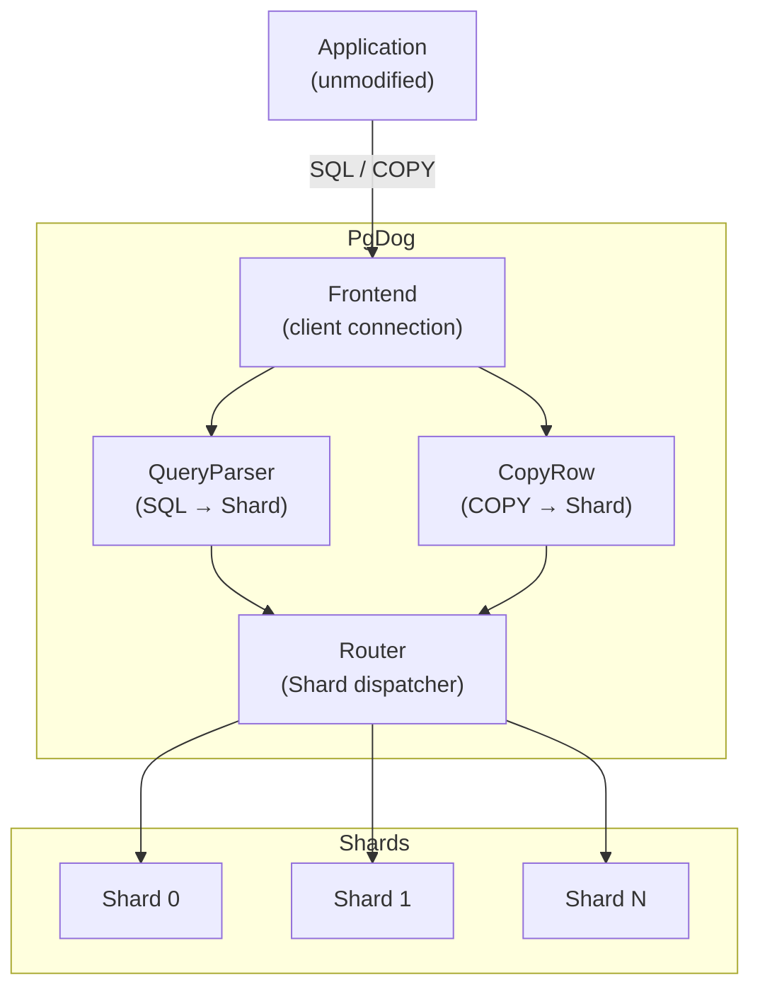

# Sharding — Implementation

This document describes how PgDog routes queries across shards at the code level. For user-facing
configuration and concepts see [Sharding basics](https://docs.pgdog.dev/features/sharding/basics/) and
[Sharding functions](https://docs.pgdog.dev/features/sharding/sharding-functions/). For the resharding
workflow see [RESHARDING.md](./RESHARDING.md).

---

## Architecture overview



The universal routing token is `Shard` in [`pgdog/src/frontend/router/parser/route.rs`](../pgdog/src/frontend/router/parser/route.rs):

```rust
pub enum Shard {
    Direct(usize),      // single shard by index
    Multi(Vec<usize>),  // explicit subset
    All,                // broadcast to every shard
}
```

Every routing decision — SQL, COPY, WAL replay — produces one of these three variants and nothing else.
The rest of the system only needs to know which variant it received.

---

## Router entry point

`Router` in [`pgdog/src/frontend/router/mod.rs`](../pgdog/src/frontend/router/mod.rs) holds a `QueryParser` and the last-computed `Command`.

- **SQL messages** → `Router::query()` calls `QueryParser::parse()` and stores the result as
  `Command::Query(Route)`. In COPY mode it returns the cached command without reparsing.
- **COPY data** → `Router::copy_data()` matches on `Command::Copy` and calls `Copy::shard()`,
  which returns `Vec<CopyRow>`. If the current command is not a COPY (i.e. not a sharded table),
  every row gets `CopyRow::omnishard` — `Shard::All`.

`Route` (also in [`route.rs`](../pgdog/src/frontend/router/parser/route.rs)) wraps a `Shard` together with metadata the connection pool and response
merger need: `read: bool` (primary vs replica), `order_by`, `aggregate`, `limit`, `distinct`, and
`rewrite_plan`. The connection pool reads `route.shard()` to select the backend; the response merger
reads the rest to reassemble cross-shard results.

---

## SQL routing — QueryParser

`QueryParser` in [`pgdog/src/frontend/router/parser/query/mod.rs`](../pgdog/src/frontend/router/parser/query/mod.rs) is re-created per query.

### Pre-parse shortcuts

Before touching the SQL AST, `parse()` checks two bypass conditions:

1. **Comment override** — `/* shard=N */` or `/* role=primary */` embedded in the SQL is extracted
   from `Ast::comment_shard` and pushed onto `shards_calculator` before the AST walk. The role
   override (`/* role=primary */`) sets `write_override = true`.

2. **Parser bypass** — if a shard is already known (from a prior `SET pgdog.shard = N` command or
   a sticky connection) and the cluster has only one shard, the full AST walk is skipped entirely
   via `query_parser_bypass()`, which returns a `Route` directly.

### Per-statement dispatch

After the pre-parse phase, the root `NodeEnum` is matched:

| NodeEnum | Handler | Notes |
|---|---|---|
| `SelectStmt` | `select()` | Key extraction + aggregation metadata |
| `InsertStmt` | `insert()` | Key from VALUES column list |
| `UpdateStmt` | `update()` | Key from SET + WHERE; may trigger shard-key rewrite (see below) |
| `DeleteStmt` | `delete()` | Key from WHERE |
| `CopyStmt` | `copy()` | Sets up `Command::Copy` for row-level routing |
| `VariableSetStmt` | `set()` | Handles `SET pgdog.shard` / `SET pgdog.role` |
| `VariableShowStmt` | `show()` | Admin SHOW commands |
| `DeallocateStmt` | — | Returns `Command::Deallocate` immediately |

Empty queries (no FROM clause, e.g. `SELECT 1` or `SELECT NOW()`) are round-robined to
`Shard::Direct(round_robin::next() % shards)` and never hit the WHERE clause walker.

### SELECT routing decision tree

`select()` in [`pgdog/src/frontend/router/parser/query/select.rs`](../pgdog/src/frontend/router/parser/query/select.rs) applies this decision sequence:

1. **Already routed** — if `shards_calculator.shard().is_direct()` (set by a prior `SET` or comment),
   skip the AST walk and return immediately with that shard.

2. **WHERE clause key** — `StatementParser::from_select().shard()` walks the AST looking for an
   equality predicate on the configured sharding column. If found, produces `Shard::Direct(hash % n)`.

3. **Vector ORDER BY** — if the ORDER BY contains an `<->` expression (L2 distance) against a
   vector-type sharding column, `Centroids::shard()` is called on the query vector. The nearest
   centroid's shard index is used.

4. **Sharded table, no key** — table is in `[[sharded_tables]]` but WHERE has no equality on the
   sharding key. Result: `Shard::All`. Aggregates, ORDER BY, and LIMIT recorded for cross-shard merge.

5. **Unsharded table (omnishard)** — table is not in `[[sharded_tables]]`:
   - If marked `sticky` → routes to `sticky.omni_index` (connection-pinned, same shard for the
     session).
   - Otherwise → `round_robin::next() % shards`.

6. **Single-shard cluster** — after the above, if result is `Shard::All` or `Shard::Multi` but
   `context.shards == 1`, it is collapsed to `Shard::Direct(0)`.

Cross-shard queries (`Shard::All` or `Shard::Multi`) carry `AggregateRewritePlan` in the `Route`.
The plan describes which columns are aggregated (`COUNT`, `SUM`, `MAX`, `MIN`, `AVG`, etc.) so the
response handler can merge partial results from each shard before returning them to the client.

### UPDATE on the sharding key

When an UPDATE sets the sharding key to a new value the row must move shards. `StatementRewrite` in
[`pgdog/src/frontend/router/parser/rewrite/statement/`](../pgdog/src/frontend/router/parser/rewrite/statement/) detects this case and rewrites the statement
as three operations: `SELECT` (fetch the full old row), `DELETE` (remove from the source shard), and
`INSERT ... ON CONFLICT DO UPDATE` (upsert on the destination shard). The rewrite is transparent to
the client. It is enabled by default and can be disabled via `rewrite.shard_key = "ignore"` in
`pgdog.toml`.

---

## Sharding functions

### Operator selection

`ContextBuilder` in [`pgdog/src/frontend/router/sharding/context_builder.rs`](../pgdog/src/frontend/router/sharding/context_builder.rs) reads the `ShardedTable`
config entry for the matched column and constructs an [`Operator`](../pgdog/src/frontend/router/sharding/operator.rs) in this priority order:

1. `centroids` populated → `Operator::Centroids { shards, probes, centroids }`
2. `mapping` is `Mapping::Range(_)` → `Operator::Range(ranges)`
3. `mapping` is `Mapping::List(_)` → `Operator::List(lists)`
4. Otherwise → `Operator::Shards(n)` (hash)

`Context::apply()` in [`context.rs`](../pgdog/src/frontend/router/sharding/context.rs) matches on the operator and calls the appropriate function,
returning `Shard::All` if the value cannot be parsed (rather than erroring):

```
Operator::Shards(n)   → hash(value) % n → Shard::Direct
Operator::Centroids   → nearest centroid index → Shard::Direct or Shard::Multi
Operator::Range       → ranges.shard(value) → Shard::Direct or Shard::All (no match)
Operator::List        → lists.shard(value) → Shard::Direct or Shard::All (no match)
```

### Hash functions

`bigint()`, `uuid()`, `varchar()` in [`pgdog/src/frontend/router/sharding/mod.rs`](../pgdog/src/frontend/router/sharding/mod.rs) all call into
[`hashfn.c`](../pgdog/src/frontend/router/sharding/hashfn.c) via FFI ([`pgdog/src/frontend/router/sharding/ffi.rs`](../pgdog/src/frontend/router/sharding/ffi.rs)). The functions are PostgreSQL's own
`hashint8extended` and `hash_bytes_extended`, so `hash(42) % N` in PgDog produces the same shard
as PostgreSQL's own hash partitioning would.

`shard_value()` handles text-format parameters; `shard_binary()` handles wire-format binary
parameters by decoding them first. `shard_str()` is called when the type is unknown — it tries
`i64` parse, then `Uuid` parse, then falls through to varchar. This is a best-effort path with a
TODO noting that having the type OID would be more reliable.

For the `SHA1` hasher (configured via `hasher = "sha1"`), `Hasher::Sha1` routes through
[`pgdog/src/frontend/router/sharding/hasher.rs`](../pgdog/src/frontend/router/sharding/hasher.rs) instead of the FFI functions.

### List and Range: unmatched values

Neither `Lists::shard()` nor `Ranges::shard()` errors on a value that matches no rule — both return
`Shard::All`. This means a misconfigured mapping silently broadcasts instead of failing. If strict
routing is required, all possible values must be covered in the mapping.

### Vector routing

`Centroids` lives in the `pgdog-vector` crate (re-exported from
[`pgdog/src/frontend/router/sharding/vector.rs`](../pgdog/src/frontend/router/sharding/vector.rs)). `Centroids::shard()` computes the L2 distance from
the query vector to each centroid using SIMD (AVX2 on x86-64, NEON on ARM64) and returns the index
of the nearest centroid. `centroid_probes` controls how many centroids are checked — higher values
improve recall at the cost of more shards being queried.

---

## COPY routing

`CopyRow` in [`pgdog/src/frontend/router/copy.rs`](../pgdog/src/frontend/router/copy.rs) wraps a `CopyData` message with a `Shard`.

The `Copy` router (in [`pgdog/src/frontend/router/parser/copy.rs`](../pgdog/src/frontend/router/parser/copy.rs)) is set up when the parser sees a
`CopyStmt` targeting a sharded table. As each `CopyData` arrives, `Copy::shard()` extracts the
sharding key column from the row (text or binary format), runs it through the same
`ContextBuilder` → `Context::apply()` pipeline, and produces a tagged `CopyRow`.

Two special cases:
- **CSV/text headers** — the header row (column names) is sent to all shards via `CopyRow::headers()`.
- **Non-sharded table** — if `Command::Copy` is not set (the target table is unsharded), every row
  becomes `CopyRow::omnishard(row)` with `Shard::All`.

The binary COPY format is handled transparently; `shard_binary()` decodes each column value from the
PostgreSQL wire format before hashing.

---

## Configuration

Config types are in [`pgdog-config/src/sharding.rs`](../pgdog-config/src/sharding.rs). The TOML keys map directly to struct fields
(all `snake_case`, `deny_unknown_fields`).

Key fields on `ShardedTable`:

| Field | Type | Notes |
|---|---|---|
| `database` | `String` | Matches a `[[databases]]` entry |
| `name` | `Option<String>` | Restricts rule to one table; absent = all tables with this column |
| `schema` | `Option<String>` | PostgreSQL schema scope |
| `column` | `String` | Sharding key column name |
| `data_type` | `DataType` | `bigint` (default), `uuid`, `varchar`, `vector` |
| `hasher` | `Hasher` | `postgres` (default, FFI to `hashint8extended`) or `sha1` |
| `centroids` | `Vec<Vector>` | Inline centroid vectors for vector sharding |
| `centroids_path` | `Option<PathBuf>` | External JSON file for large centroid sets |
| `centroid_probes` | `usize` | Probes per query; defaults to `√(centroid count)` |
| `mapping` | `Option<Mapping>` | Resolved from `[[sharded_mappings]]` at startup; not set in TOML directly |
| `primary` | `bool` | Marks this table as the sharding anchor for FK-based query resolution |

`[[sharded_mappings]]` entries resolve to either `Mapping::List(ListShards)` or `Mapping::Range(Ranges)`
and are joined to their `ShardedTable` at startup. A mapping that covers only some values leaves the
rest as `Shard::All` — there is no error. A `ShardedMappingKind::Default` entry acts as a catch-all.

### Schema-based sharding

`[[sharded_schemas]]` in `pgdog.toml` maps a PostgreSQL schema name to a fixed shard index. This is
useful for schema-per-tenant deployments where each tenant's data lives in a dedicated schema.
`SchemaSharder` in [`pgdog/src/frontend/router/sharding/schema.rs`](../pgdog/src/frontend/router/sharding/schema.rs) resolves the current
`search_path` against the `ShardedSchema` list (`pgdog-config/src/sharding.rs`). A `name = null`
entry acts as the catch-all; a specific schema name overrides it even if the catch-all was matched first.

Schema routing takes effect at the connection level and is re-evaluated whenever `search_path` changes.