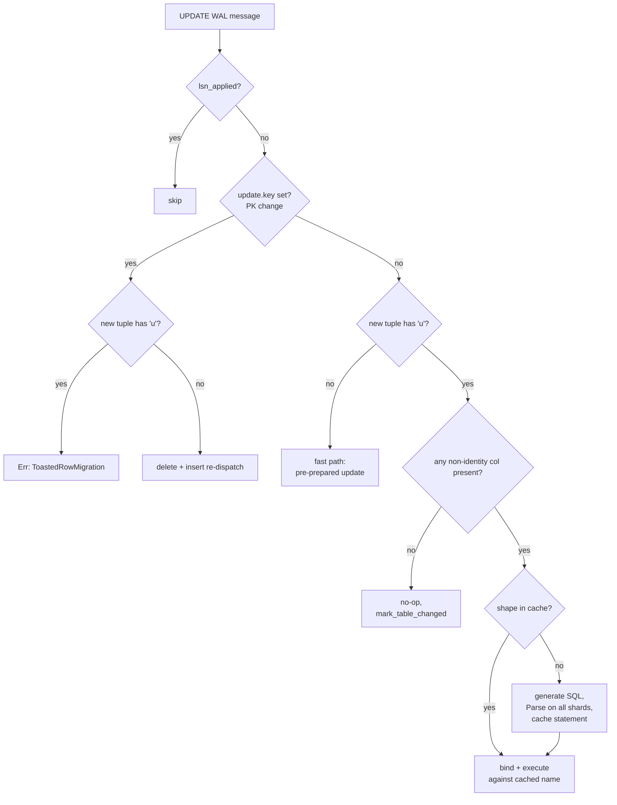

# Plan — unchanged-TOAST replication fix

## Problem

During WAL apply after the initial COPY, any UPDATE on a sharded row that does not rewrite its TOAST column silently overwrites that column with an empty value on the destination shard. No error, no log.

Root cause: `TupleData::to_bind` in `pgdog/src/net/messages/replication/logical/tuple_data.rs` only special-cases `Identifier::Null`. `Identifier::Toasted` falls through to `Parameter::new(&[])`, producing an empty-string bind parameter.

Three broken paths in `pgdog/src/backend/replication/logical/subscriber/stream.rs`:

- `StreamSubscriber::update` non-PK-change branch — binds every non-identity column from `update.new` and runs the pre-prepared `UPDATE … SET …` that references all of them.
- `StreamSubscriber::update` PK-change branch — re-packages `update.new` as `XLogInsert` and runs the upsert, whose `ON CONFLICT DO UPDATE SET` clause references all columns.
- `StreamSubscriber::insert` — same upsert; if pgoutput ever emits `'u'` on a true INSERT the column is written empty.

## Design — lazy per-shape prepared-statement cache

"Shape" = bitmask of which non-identity columns are present (Format / Null) vs unchanged-TOAST (`'u'`). Identity columns are always present by construction and are not part of the key.

Policy:

- **Fast path** — tuple contains no `'u'`. Use the existing pre-prepared `update` / `upsert` statements. Zero new cost.
- **Slow path** — tuple contains any `'u'`. Look up the shape in a per-oid `HashMap<u64, Statement>`. On miss: generate the filtered SQL, `Parse` it on every shard connection, cache the `Statement`. Then `Bind` + `Execute` + `Flush` against the cached name, same as fast path.
- **All-toasted UPDATE** — all non-identity columns are `'u'` and identity columns did not change (otherwise we'd be in the PK-change branch). No-op; advance the per-oid watermark via `mark_table_changed` and return.
- **Any `'u'` in INSERT** — `Error::ToastedInsertTuple`. Unreconstructible without a source-side lookup.
- **Any `'u'` in PK-change UPDATE's new tuple** — `Error::ToastedRowMigration`. The row moves to a different shard; the destination row doesn't exist yet and we can't build a complete INSERT.



Cache invalidation is automatic: `StreamSubscriber::relation` overwrites `Statements` for an oid on every new Relation message. The shape map lives inside `Statements` and gets dropped with it.

Growth bound: at most `2^K` entries per table, where K is the non-identity column count. Cap K at 64 (enforced at `Table::load` via `Error::TooManyColumns`).

## Slow-path walkthrough — multiple `'u'` columns

Take a concrete table with two TOAST-capable columns:

```sql
posts(
  id         bigint PRIMARY KEY,   -- identity col (index 0)
  tenant_id  bigint,                -- non-id col 0 (mask bit 0)
  title      text,                  -- non-id col 1 (mask bit 1)
  body       text,                  -- non-id col 2 (mask bit 2)  ← TOAST
  metadata   jsonb,                 -- non-id col 3 (mask bit 3)  ← TOAST
  updated_at timestamptz            -- non-id col 4 (mask bit 4)
)
```

The app runs `UPDATE posts SET updated_at = now() WHERE id = 42`. Neither `body` nor `metadata` is touched, both live externally in TOAST, so pgoutput sends them as `'u'`.

**Bitmask construction** — `PresentColumns::from_tuple` walks `update.new.columns` and records, for every non-identity column, whether its `Identifier` is `Format(_)` / `Null` (bit `1`) or `Toasted` (bit `0`):

| non-id col | column | identifier | bit |
|---|---|---|---|
| 0 | tenant_id | `'n'` (Null) | 1 |
| 1 | title | `'t'` (text) | 1 |
| 2 | body | `'u'` | **0** |
| 3 | metadata | `'u'` | **0** |
| 4 | updated_at | `'t'` | 1 |

`bits()` = `0b10011` = 19. Identity columns don't participate — they're always present.

**Cache lookup** — `self.statements[oid].update_shapes.get(&19)`. On miss, `ensure_update_shape` builds the SQL, allocates a fresh statement name, sends `Parse` + `Flush`/`Sync` to every shard connection, drains responses, and inserts the `Statement` into `update_shapes`. On hit, reuse.

**Generated SQL** — `update_sql_present` filters `SET` to present non-identity columns and renumbers parameters `$1..$N` sequentially (SET params first in table order, then identity-column params for the `WHERE`):

```sql
UPDATE "public"."posts"
SET "tenant_id" = $1,
    "title"     = $2,
    "updated_at"= $3
WHERE "id" = $4
```

`body` and `metadata` are absent from `SET` entirely — the destination row keeps whatever it had. Parameter numbering is sequential; no `$3`, `$4` gaps where the filtered columns used to be.

**Bind construction** — `to_bind_present(name, &present)` walks `update.new.columns` in the same order and emits one `Parameter` per column whose index is in `present`:

| param | column | source value |
|---|---|---|
| `$1` | tenant_id | `Parameter::new_null()` |
| `$2` | title | text bytes from tuple |
| `$3` | updated_at | text bytes from tuple |
| `$4` | id | identity value from tuple |

`'u'` columns are skipped — their `Bytes` are `Bytes::new()` but they never become parameters, so there's no risk of binding an empty string as a real value.

**Wire exchange (cache hit)** — identical protocol footprint to the fast path:

```
C→S: Bind("__pgdog_xxx", [null, "...", "2026-04-24T...", 42])
C→S: Execute + Flush
S→C: BindComplete, CommandComplete "UPDATE 1"
```

**Different shape, same table** — a later `UPDATE posts SET title = 'new' WHERE id = 7` with `body`/`metadata` still `'u'` has mask `0b10010` = 18: title present, the rest absent. Different `update_shapes` entry. First occurrence prepares `UPDATE "public"."posts" SET "title" = $1 WHERE "id" = $2`; subsequent same-shape messages reuse it. Real workloads converge on 1–3 shapes per table.

**Concurrency** — the subscriber processes WAL messages serially on a single task per publication, so `update_shapes` is accessed without locking. The map grows monotonically during a replication stream; the only clearing event is a new `Relation` message, which replaces the whole `Statements` entry for that oid via `StreamSubscriber::relation` and drops the map with it.

## Alternatives rejected

- **Inline unnamed `Parse` per slow-path row.** Correct, but a bulk UPDATE burst of N same-shape rows becomes N server-side parses vs 1 with the cache.
- **Eager enumeration of all shape variants at `relation()` time.** Wastes `Parse` work on shapes that may never occur. `2^K` is bounded but pessimistic.
- **Source-side round-trip to fetch missing TOAST values.** Would make the PK-change branch recoverable, but requires a dedicated source connection, opens an ordering hazard against concurrent source writes, and is too complex for v1.

## Implementation

### `pgdog/src/backend/replication/logical/publisher/table.rs`

Add:

```rust
pub struct PresentColumns {
    mask: u64,
    len: u8,
}

impl PresentColumns {
    pub fn from_tuple(tuple: &TupleData, ncols: usize) -> Result<Self, Error>;
    pub fn all(ncols: usize) -> Result<Self, Error>;
    pub fn is_set(&self, idx: usize) -> bool;
    pub fn is_all_present(&self) -> bool;
    pub fn no_non_identity_present(&self, table: &Table) -> bool;
    pub fn bits(&self) -> u64;
}

impl Table {
    pub fn update_sql_present(&self, present: &PresentColumns) -> String;
}
```

`update_sql_present` filters the `SET` clause to present non-identity columns and renumbers parameters `$1..$N` sequentially (SET columns first in table order, then identity columns for the WHERE clause). Existing `update()` / `insert(bool)` / `delete()` stay as-is; they're the fast path.

Enforce column-count cap in `Table::load` / `reload`: if `columns.len() > 64`, return `Error::TooManyColumns { table, got, max: 64 }`.

### `pgdog/src/net/messages/replication/logical/tuple_data.rs`

Add:

```rust
impl TupleData {
    pub fn has_toasted(&self) -> bool;
    pub fn to_bind_present(&self, name: &str, present: &PresentColumns) -> Bind;
}
```

`to_bind_present` iterates columns, skipping indices not in `present`, and builds the `Bind` with the same param order the SQL generator used. Debug-assert in the existing `to_bind` that no column carries `Identifier::Toasted` — fast-path invariant.

Fix `Column::to_sql` — `Identifier::Toasted` currently renders `"NULL"`. Change to `"<unchanged toast>"` so debug output stops impersonating NULL.

### `pgdog/src/backend/replication/logical/subscriber/stream.rs`

Extend `Statements`:

```rust
struct Statements {
    insert: Statement,
    upsert: Statement,
    update: Statement,
    delete: Statement,
    omni: bool,
    update_shapes: HashMap<u64, Statement>,
}
```

Add `ensure_update_shape(&mut self, oid: Oid, present: &PresentColumns) -> Result<&Statement, Error>`:

1. If `update_shapes.contains_key(present.bits())`, return the cached `Statement`.
2. Otherwise build `table.update_sql_present(present)`, wrap in `Statement::new`.
3. Send the `Parse` to every connection in `self.connections`, terminated by `Flush` if `in_transaction` else `Sync`.
4. Drain `ParseComplete` / `ReadyForQuery` per connection using the same loop shape as the existing `relation()` handler.
5. Insert into `update_shapes`, return the new entry.

Factor out `StreamContext::shard_for(&'a Cluster, &TupleData, &Table) -> Result<Shard, Error>` so the slow path can compute routing without holding a `&Parse`.

Wire the branches into `update`:

- PK-change → guard `has_toasted` → delete+insert re-dispatch.
- Non-PK-change, no `'u'` → fast path unchanged.
- Non-PK-change, `has_toasted` and `no_non_identity_present` → `mark_table_changed` + return.
- Non-PK-change, `has_toasted` otherwise → `ensure_update_shape` → `to_bind_present` → `send` via `shard_for`.

Add `has_toasted` guard at the top of `insert`; fail with `Error::ToastedInsertTuple`.

### `pgdog/src/backend/replication/logical/error.rs`

Add variants:

- `ToastedInsertTuple { table: String, oid: Oid }`
- `ToastedRowMigration { table: String, oid: Oid }`
- `TooManyColumns { table: String, got: usize, max: usize }`

Error messages include the next step for the operator (verify publication, avoid updating sharding-key columns on TOASTed rows, split the table).

## Tests

### Unit — `pgdog/src/backend/replication/logical/publisher/table.rs`

- `update_sql_present(all)` byte-equals `update()`.
- Partial-present — SET clause omits filtered columns; params are `$1..$N` sequential.
- Identity-not-first — WHERE params start after the SET params, sequential.
- `PresentColumns::from_tuple` returns `TooManyColumns` on > 64 columns.

### Unit — `pgdog/src/backend/replication/logical/subscriber/tests.rs`

- Shape reuse — two Updates with the same `'u'` pattern → one `Parse` observed on the mock shard, two `Bind`s.
- Shape divergence — two Updates with different `'u'` patterns → two `Parse`s with distinct statement names.
- Fast-path regression — Update with no `'u'` → zero new `Parse`, reuses the pre-prepared name.
- All-toasted UPDATE no-op — no messages sent to any shard; `mark_table_changed` still fires.
- `ToastedInsertTuple` on Insert with `'u'`.
- `ToastedRowMigration` on PK-change UPDATE with `'u'` in the new tuple.
- Relation refresh invalidates — send a Relation, prepare a shape, send a new Relation for the same oid, send the same shape → re-preparation observed.

### Integration — new `integration/copy_data/toast/run.sh`

Sharded table with one large text column forced to TOAST (`ALTER COLUMN body SET STORAGE EXTERNAL`, rows ≥ 16 KB).

1. Initial copy → assert `octet_length(body)` on every shard matches source.
2. `UPDATE t SET other_col = … WHERE id = …` on source → wait ≤ 30 s → assert `other_col` updated AND `octet_length(body)` unchanged.
3. `UPDATE t SET body = 'small' WHERE id = …` → assert destination shrinks.
4. `DELETE FROM t WHERE id = …` on a TOASTed row → assert removal.

Wire into `integration/copy_data/run.sh` and the `copy_data` job in `.rwx/integration.yml`.

## Execution order

1. `PresentColumns` + `update_sql_present` + column-cap + unit tests in `publisher/table.rs`.
2. `has_toasted` / `to_bind_present` + debug-assert + `to_sql` fix in `tuple_data.rs`.
3. New `Error` variants.
4. `StreamContext::shard_for` refactor.
5. Extend `Statements` with `update_shapes`; add `ensure_update_shape`.
6. Wire slow path into `update()`; add guards in `insert()` and PK-change branch.
7. Subscriber unit tests.
8. Integration test.

## Verification

- `cargo test -p pgdog backend::replication::logical::` green.
- `bash integration/copy_data/run.sh` green including the new `toast/` scenario.
- Burst of same-shape UPDATEs in the integration test triggers exactly one `ensure_update_shape` per `(oid, shape)`.

## Non-goals

- PK-change UPDATE with `'u'` recovery via source round-trip.
- `'O'` block / `REPLICA IDENTITY FULL` identity extraction.
- #914 pool-shutdown race.
